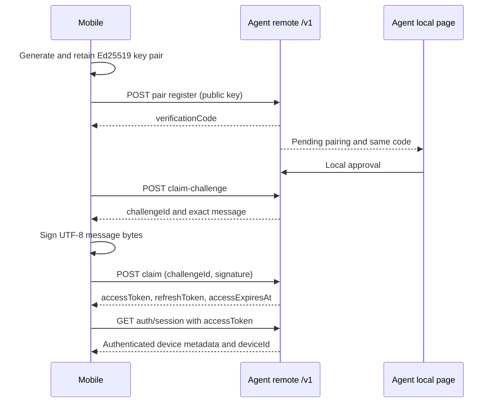
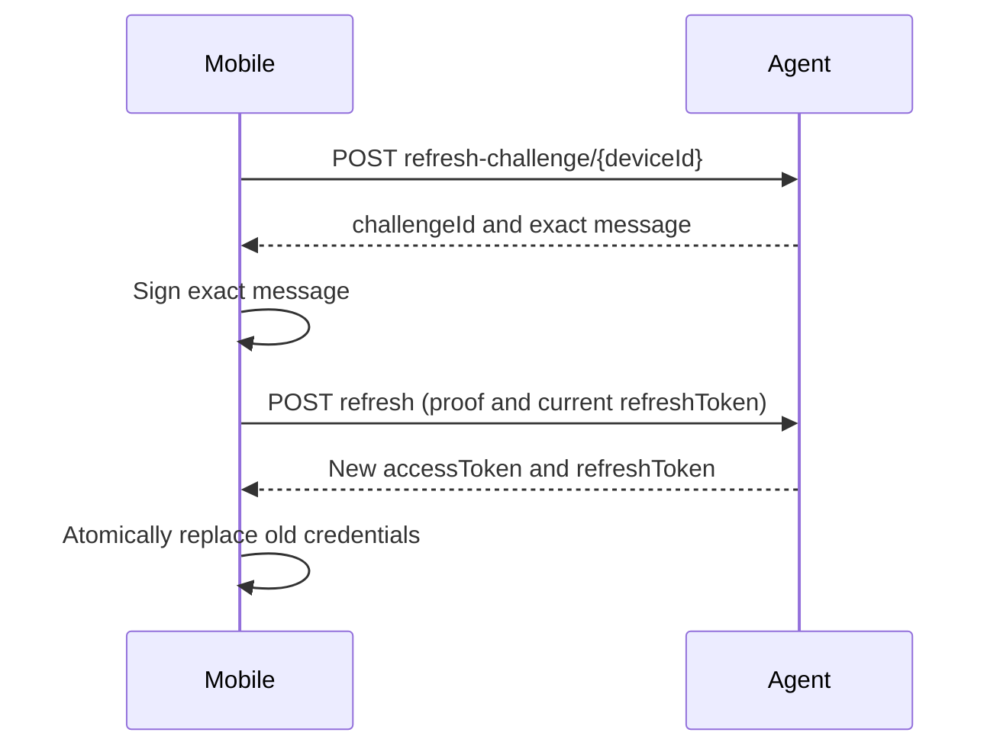
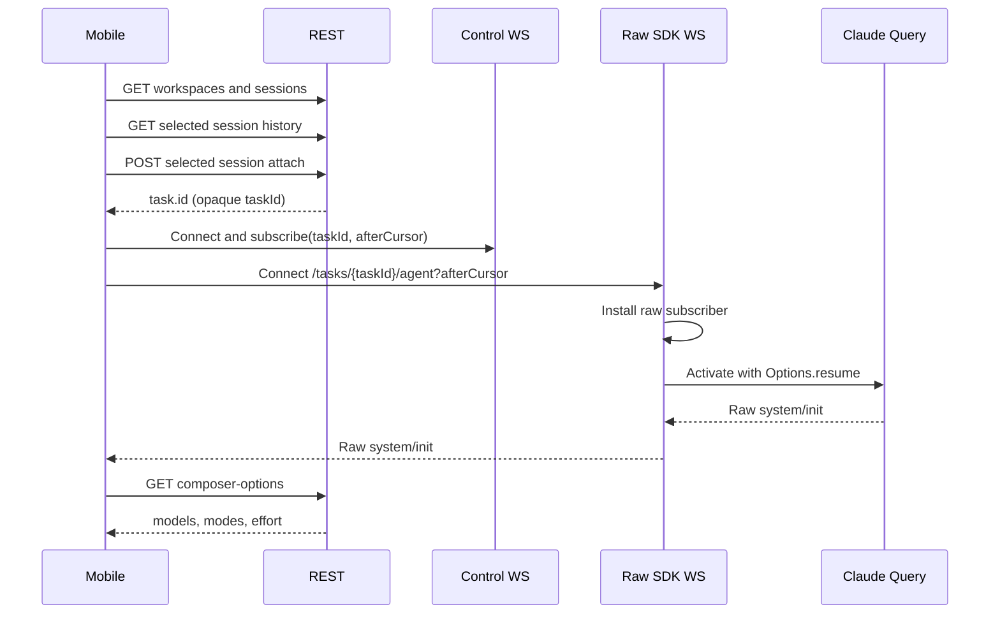
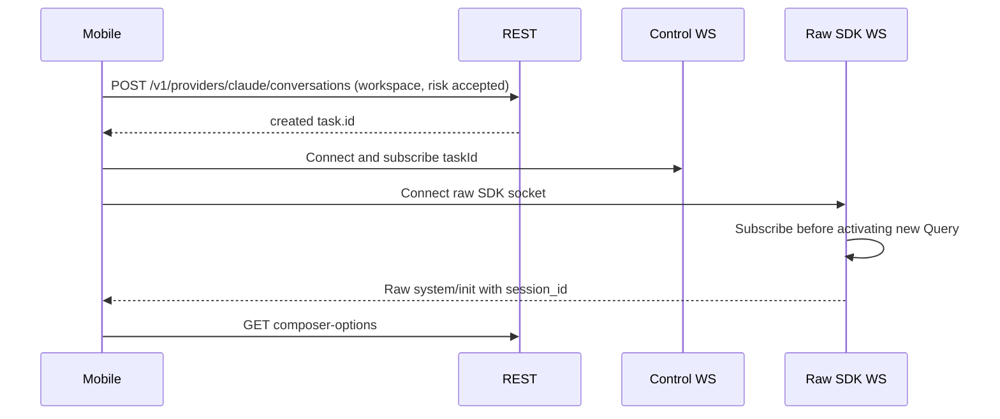
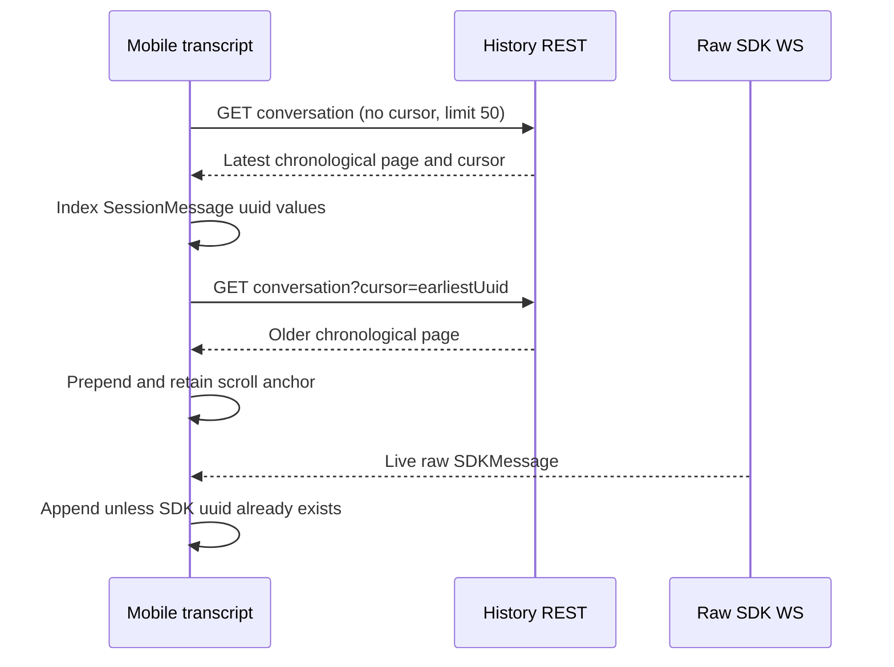
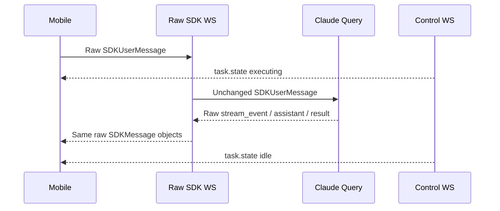
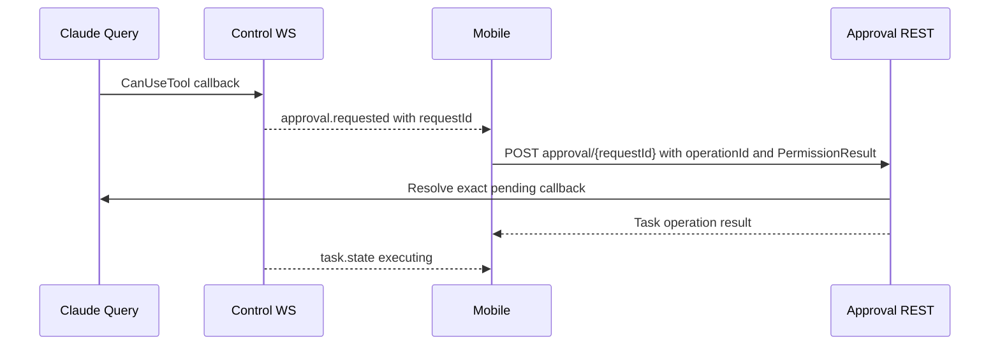
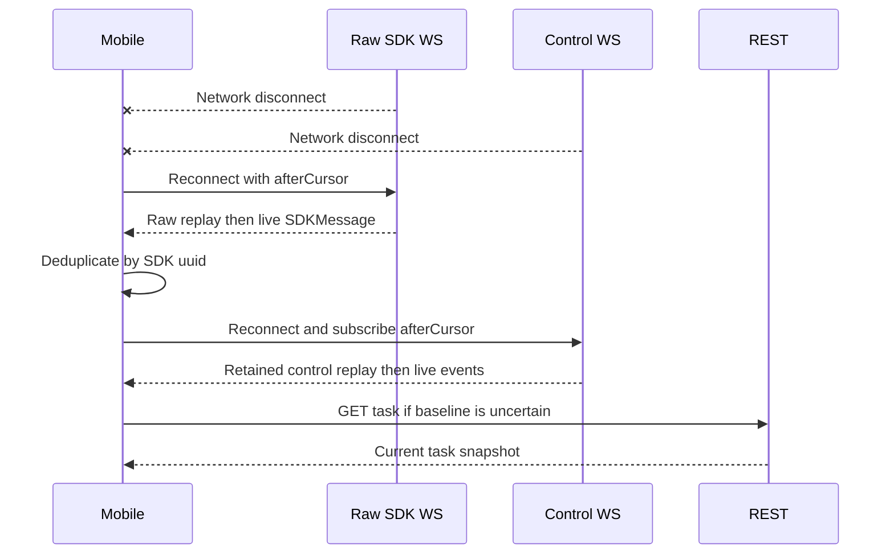
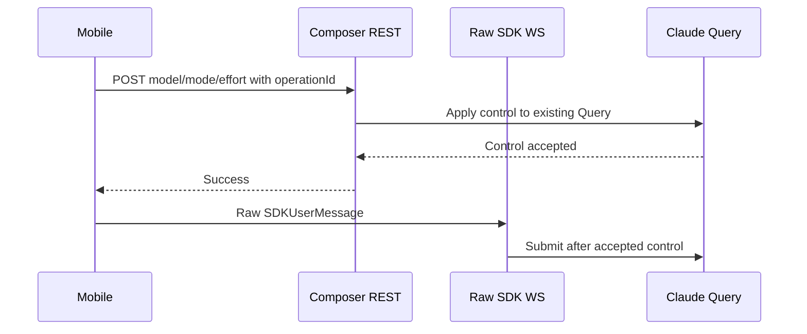
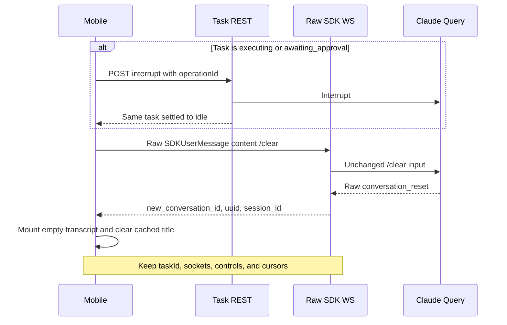

# PocketPilot Mobile Integration Guide

> **Verified contract:** PocketPilot remote API `/v1`, OpenAPI `3.1.0`
> (`info.version: 1.0.0`), protocol version `1`, and
> `@anthropic-ai/claude-agent-sdk@0.3.210`, verified 2026-07-18.
>
> **Schema sources:** the running Agent's local Swagger UI at
> `/documentation/`, raw OpenAPI at `/documentation/json`, the packaged
> [`dist/openapi/mobile-v1.json`](../dist/openapi/mobile-v1.json), and the
> installed Claude Agent SDK declarations. This guide explains workflow and
> ownership; OpenAPI and SDK types remain authoritative for fields.

## 1. Purpose, Audience, Versions, and Sources of Truth

This guide is for any mobile client that connects to a user-operated
PocketPilot Agent. It specifies pairing, authentication, provider/workspace
and conversation discovery, history, live conversation transport, task controls,
approvals, reconnection, the fixed Command panel, and same-workspace New
conversation behavior. It is intentionally platform-neutral.

Use this authority order when sources differ:

1. Current runtime Zod schemas and generated OpenAPI for REST and PocketPilot
   control messages.
2. `@anthropic-ai/claude-agent-sdk@0.3.210` declarations for raw
   `SDKUserMessage`, `SDKMessage`, `SessionMessage`, and `PermissionResult`.
3. This guide for cross-operation sequencing and client state ownership.

The English file is canonical. The
[`Simplified Chinese guide`](./mobile-integration-guide.zh-CN.md) is a strict
translation. A backend or SDK upgrade is not compatible merely because JSON
still parses: regenerate REST bindings from OpenAPI, recheck the pinned SDK
types, and rerun the flows in section 16 before releasing the mobile client.

## 2. Non-Negotiable Boundaries and Identity

### 2.1 Protocol boundaries

- PocketPilot is an authenticated transport and runtime controller around
  locally installed Agent providers. It does not define a second conversation
  protocol or normalize provider-native messages.
- `/v1/tasks/{taskId}/agent` is the bidirectional provider-native stream. For
  `provider: "claude"`, client frames are raw `SDKUserMessage` objects and
  server frames are raw `SDKMessage` objects.
- `/v1/events` carries PocketPilot control events only. It never carries an SDK
  message, even inside a `kind: "sdk"` envelope.
- Historical rows remain provider-native. Claude rows are SDK
  `SessionMessage` objects; they are not live `SDKMessage` objects and must not
  be converted back into prompts.
- Unknown SDK fields and message variants are forward-compatible data. Preserve
  or ignore them safely; do not reject an entire session because a new variant
  appears.

Wrong SDK output:

```json
{
  "kind": "sdk",
  "payload": {
    "kind": "assistant.stream-event",
    "message": { "type": "stream_event" }
  }
}
```

Correct SDK output:

```json
{
  "type": "stream_event",
  "event": {
    "type": "content_block_delta",
    "index": 0,
    "delta": { "type": "text_delta", "text": "Working" }
  },
  "parent_tool_use_id": null,
  "uuid": "80000000-0000-4000-8000-000000000002",
  "session_id": "70000000-0000-4000-8000-000000000001"
}
```

PocketPilot enables `includePartialMessages: true` for every new and resumed
Agent SDK Query. A live turn therefore normally emits several raw
`stream_event` messages (including `content_block_delta`) before the complete
`assistant` message. Merge the deltas immediately, then reconcile the final
content with `assistant.message.content[]`. Do not fabricate token animation or
wrap SDK messages in a second protocol.

### 2.2 Identity table

| Identifier | Owner and purpose | Lifetime and client rule |
| --- | --- | --- |
| `providerId` | Stable provider path identity, such as `claude` | Discover it from `/v1/providers`; never infer support from installed files or hard-code availability. |
| `conversationId` | Provider-native conversation identity used in provider-scoped REST paths | For Claude this is the SDK session ID selected from an unchanged `SDKSessionInfo` row. |
| `taskId` | PocketPilot runtime/control handle for routing, state, approvals, replay, scheduling, and one live Query | Stable across turns and `conversation_reset`. Keep it out of user-facing conversation identity. |
| `sdkSessionId` / raw `session_id` | Claude persistence and resume identity | Observe SDK-owned values. Never derive it from `taskId` or replay history as a substitute. |
| SDK `uuid` | Identity for an SDK history/live message and SDK replay anchor | Use for history/live deduplication and the provider-native value carried by `afterCursor` when present. A valid live message can omit it. |
| `new_conversation_id` | New transcript boundary emitted by raw `conversation_reset` | Mount a fresh transcript and clear cached title state. Do not rotate `taskId`. Do not assume it equals `session_id`. |
| `operationId` | Client-generated UUID for idempotent HTTP mutations | Generate once per distinct mutation; reuse only when retrying that same mutation. Never put it in raw SDK frames. |
| approval `requestId` | SDK permission callback identity | Resolve only the currently pending request. It is unrelated to HTTP `operationId`. |
| control `cursor` | PocketPilot control replay position | Store per `taskId`; send as `afterCursor`. It is unrelated to SDK `uuid`. |

## 3. Transport Overview and End-to-End Flow

### 3.1 Transports

| Surface | Direction | Authentication | Content |
| --- | --- | --- | --- |
| `/v1/*` REST | Request/response | Public only where listed below; otherwise `Authorization: Bearer <accessToken>` | Pairing, discovery, task metadata, controls, approvals |
| `/v1/tasks/{taskId}/agent` | Bidirectional WebSocket | Bearer header during handshake | Provider-native messages; raw `SDKUserMessage`/`SDKMessage` when `task.provider` is `claude` |
| `/v1/events` | Bidirectional WebSocket | Bearer header during handshake | Subscribe requests and PocketPilot control events only |

Convert the QR `baseUrl` scheme when opening WebSockets: `https` becomes
`wss`, and `http` becomes `ws`. Never place the access credential in the URL,
query string, logs, analytics, crash reports, or screenshots.

### 3.2 Canonical user flow

1. Pair and retain the device key plus rotating credentials.
2. Authenticate, call `GET /v1/providers`, and select an `available` provider.
   Unavailable providers remain listed with a stable `reasonCode` (for example
   `CODEX_COMMAND_NOT_FOUND` or `CLAUDE_SDK_NOT_AVAILABLE`). Discovery and
   capabilities refresh host readiness with a short server-side TTL and never
   expose install paths, credentials, or raw process diagnostics.
3. Read `/v1/providers/{providerId}/capabilities`, then call
   `GET /v1/workspaces`.
4. Select an authorized workspace, then call
   `GET /v1/providers/{providerId}/conversations`.
5. Select a provider-native conversation or choose New conversation.
6. For an existing conversation, load its latest history page for display.
7. Attach the selected conversation or create its runtime. Retain the
   returned `task.id` internally as `taskId`; do not show a separate task step.
8. Open `/v1/events` and subscribe to `taskId`.
9. Open `/v1/tasks/{taskId}/agent`. The server installs the native subscriber before
   activating the new or resumed Query.
10. After the Agent socket is open, request composer options and reconcile them
   with raw `system/init` and `system/status` messages.
11. For Claude, send ordinary prompts and slash commands as raw
    `SDKUserMessage` frames.

Task creation, task selection, and task resume are internal transport details,
not extra conversation screens. Selecting a Claude session is the user's
continue action.

### 3.3 REST operation inventory

All protected operations use `bearerAuth`. Request and response property detail
must be generated from OpenAPI rather than copied from this table.

| Area | Method and path | `operationId` | Access / purpose |
| --- | --- | --- | --- |
| Pairing | `POST /v1/pair/{pairingId}/register` | `registerPairingDevice` | Public bootstrap; register device key |
| Pairing | `POST /v1/pair/{pairingId}/claim-challenge` | `createPairingClaimChallenge` | Public bootstrap; get proof challenge after local approval |
| Pairing | `POST /v1/pair/{pairingId}/claim` | `claimPairingCredentials` | Public bootstrap; claim first credentials |
| Authentication | `POST /v1/auth/refresh-challenge/{deviceId}` | `createRefreshChallenge` | Public bootstrap; get refresh proof challenge |
| Authentication | `POST /v1/auth/refresh` | `refreshCredentials` | Public bootstrap; rotate credentials |
| Authentication | `GET /v1/auth/session` | `getAuthenticatedDeviceSession` | Protected; validate access and read device metadata |
| Providers | `GET /v1/providers` | `listAgentProviders` | Protected; list available and unavailable local providers with refreshed readiness |
| Providers | `GET /v1/providers/{providerId}/capabilities` | `getAgentProviderCapabilities` | Protected; read status, native protocol version, and capabilities |
| Conversations | `GET /v1/providers/{providerId}/conversations` | `listAgentConversations` | Protected; list provider-native workspace conversations |
| Conversations | `POST /v1/providers/{providerId}/conversations` | `createAgentConversation` | Protected; create an empty-history runtime |
| Conversations | `GET /v1/providers/{providerId}/conversations/{conversationId}` | `readAgentConversation` | Protected; read a provider-native history page |
| Conversations | `POST /v1/providers/{providerId}/conversations/{conversationId}/attach` | `attachAgentConversation` | Protected; attach/reuse a conversation runtime |
| Tasks | `GET /v1/capabilities` | `getCapabilities` | Protected; protocol version and permission modes |
| Tasks | `GET /v1/workspaces` | `listAuthorizedWorkspaces` | Protected; configured authorized roots |
| Tasks | `GET /v1/tasks` | `listTasks` | Protected; internal runtime metadata list |
| Tasks | `POST /v1/tasks` | `createTask` | Protected; low-level explicit task creation |
| Tasks | `GET /v1/tasks/{taskId}` | `getTask` | Protected; refresh runtime state |
| Tasks | `POST /v1/tasks/{taskId}/interrupt` | `interruptTask` | Protected mutation; cancel current work/approval |
| Tasks | `POST /v1/tasks/{taskId}/close` | `closeTask` | Protected mutation; terminal close |
| Tasks | `POST /v1/tasks/{taskId}/resume` | `resumeTask` | Protected mutation; recover a persisted interrupted task |
| Composer | `GET /v1/tasks/{taskId}/composer-options` | `getTaskComposerOptions` | Protected; models, modes, and effort |
| Composer | `POST /v1/tasks/{taskId}/model` | `setTaskModel` | Protected mutation; next-turn model |
| Composer | `POST /v1/tasks/{taskId}/permission-mode` | `setTaskPermissionMode` | Protected mutation; permission mode |
| Composer | `POST /v1/tasks/{taskId}/effort` | `setTaskEffort` | Protected mutation; next-turn effort |
| Approval | `POST /v1/tasks/{taskId}/approvals/{requestId}` | `resolveTaskApproval` | Protected mutation; complete SDK `PermissionResult` |
| Events | `GET /v1/events` | `subscribeTaskEvents` | Protected WebSocket upgrade |
| Agent Stream | `GET /v1/tasks/{taskId}/agent` | `streamTaskAgentMessages` | Protected provider-native WebSocket upgrade |

## 4. Pairing, Device Proof, Credential Claim, Refresh, and Revocation

### 4.1 Pairing and claim

The computer creates and displays the QR locally. The mobile client consumes,
but never creates or edits, this payload:

```json
{
  "version": 1,
  "agentId": "10000000-0000-4000-8000-000000000001",
  "baseUrl": "https://agent.example.test",
  "pairingId": "20000000-0000-4000-8000-000000000001",
  "expiresAt": 1784304300000
}
```

The QR expires after five minutes and contains no access or refresh credential.
Reject an unsupported `version`, an invalid URL, or an expired payload before
contacting the Agent.

Generate and retain an Ed25519 key pair on the device. Send the canonical
unpadded base64url encoding of the raw 32-byte public key:

```http
POST /v1/pair/20000000-0000-4000-8000-000000000001/register
Content-Type: application/json

{
  "deviceDisplayName": "Synthetic mobile device",
  "devicePublicKey": "AAAAAAAAAAAAAAAAAAAAAAAAAAAAAAAAAAAAAAAAAAA"
}
```

The response contains `pairingId`, `expiresAt`, and a six-digit
`verificationCode`. Show that code to the user. The user verifies and approves
the same code on the Agent computer; mobile cannot call the local `/admin/*`
approval route.

After local approval, request a claim challenge. Sign the exact UTF-8 bytes of
the returned `message` string. Do not parse and reserialize it.

```http
POST /v1/pair/20000000-0000-4000-8000-000000000001/claim-challenge
```

```json
{
  "challengeId": "40000000-0000-4000-8000-000000000001",
  "expiresAt": 1784304300000,
  "message": "{\"agentId\":\"10000000-0000-4000-8000-000000000001\",\"challengeId\":\"40000000-0000-4000-8000-000000000001\",\"deviceId\":\"30000000-0000-4000-8000-000000000001\",\"expiresAt\":1784304300000,\"nonce\":\"AAAAAAAAAAAAAAAAAAAAAAAAAAAAAAAAAAAAAAAAAAA\",\"pairingId\":\"20000000-0000-4000-8000-000000000001\",\"purpose\":\"pairing_claim\",\"version\":1}",
  "nonce": "AAAAAAAAAAAAAAAAAAAAAAAAAAAAAAAAAAAAAAAAAAA"
}
```

```http
POST /v1/pair/20000000-0000-4000-8000-000000000001/claim
Content-Type: application/json

{
  "challengeId": "40000000-0000-4000-8000-000000000001",
  "signature": "AAAAAAAAAAAAAAAAAAAAAAAAAAAAAAAAAAAAAAAAAAAAAAAAAAAAAAAAAAAAAAAAAAAAAAAAAAAAAAAAAAAAAA"
}
```

All values above are synthetic and cannot authenticate. A real signature is
the canonical unpadded base64url encoding of 64 Ed25519 signature bytes.

The successful claim returns `accessToken`, `accessExpiresAt`, and
`refreshToken`. Immediately call protected `GET /v1/auth/session` with that
access credential and retain its device `id`; refresh challenge URLs require
this `deviceId`. If the claim response is lost, request a fresh claim challenge
and claim again before the pairing expires; the Agent supersedes the
undelivered credential chain.

### 4.2 Credential rules

- Access credentials expire after one hour. Refresh credentials expire after
  thirty days without use.
- Treat both as opaque strings. Never parse their internal `ppat.*` or `pprt.*`
  shape.
- Store the private key, access credential, refresh credential, device ID, and
  Agent identity in device-protected credential storage. The private key must
  never leave the device.
- Use `Authorization: Bearer <accessToken>` for every protected HTTP request
  and both WebSocket handshakes.
- Validate access with `GET /v1/auth/session` after launch, credential restore,
  or uncertain network recovery.

### 4.3 Refresh rotation

1. Call `POST /v1/auth/refresh-challenge/{deviceId}`.
2. Sign the exact returned `message` bytes with the same Ed25519 private key.
3. Call `POST /v1/auth/refresh` with `challengeId`, `signature`, and the current
   `refreshToken`.
4. Atomically replace both locally stored credentials only after a successful
   response. Do not continue using the predecessor refresh credential.

```json
{
  "challengeId": "40000000-0000-4000-8000-000000000002",
  "signature": "AAAAAAAAAAAAAAAAAAAAAAAAAAAAAAAAAAAAAAAAAAAAAAAAAAAAAAAAAAAAAAAAAAAAAAAAAAAAAAAAAAAAAA",
  "refreshToken": "pprt.30000000-0000-4000-8000-000000000001.synthetic-refresh-secret"
}
```

A verified use of a superseded refresh credential returns
`REFRESH_TOKEN_REUSED`, revokes the device, and closes all of that device's
sockets with code `4003`. Delete local credentials and require pairing again.
The same recovery applies to `DEVICE_REVOKED`, `ACCESS_TOKEN_REVOKED`, or a
locally confirmed revocation. An expired access token can be refreshed; an
expired refresh token requires pairing again.

## 5. Authorized Workspaces and Claude Session Discovery

`GET /v1/workspaces` returns only roots configured by the user on the Agent
computer:

```json
{
  "workspaceRoots": ["D:\\Projects\\demo-app", "D:\\Projects\\sample-api"]
}
```

An empty array is valid and means the computer user has not authorized a
workspace. Mobile cannot add, remove, browse, or infer directories. Ask the
user to configure them locally.

The selected `workspace` is sent to all session operations. The Agent
canonicalizes it again and enforces current authorization. For operations that
create or attach a runtime, `workspaceRiskAccepted: true` confirms that the
user accepts the working-directory scope. Authorized roots constrain initial
`cwd`; they are not a filesystem sandbox for Claude or its tools.

List provider-native conversations with the common cursor envelope:

```http
GET /v1/providers/claude/conversations?workspace=D%3A%5CProjects%5Cdemo-app&limit=50
Authorization: Bearer <accessToken>
```

The response is `{ conversations: SDKSessionInfo[], page: { cursor, hasMore } }`.
Rows are SDK-owned and may gain fields. For Claude, the opaque `page.cursor`
contains the next offset used by the SDK catalog; pass it back as `cursor` while
`page.hasMore` is true, even if a page's `conversations` array is empty after
workspace-policy filtering. Worktrees are excluded; programmatic sessions are
included.

For an existing session, use its `sessionId` in history and attach requests.
For a new conversation with no active Query, call:

```json
{
  "operationId": "50000000-0000-4000-8000-000000000001",
  "workspace": "D:\\Projects\\demo-app",
  "workspaceRiskAccepted": true
}
```

on `POST /v1/providers/claude/conversations`. Claude Code resolves its own model, permission, and
effort defaults. Do not use low-level `POST /v1/tasks` for this normal user
flow.

## 6. History Pagination and Transcript Ownership

### 6.1 Latest and older pages

Request the latest page with no `cursor`:

```http
GET /v1/providers/claude/conversations/70000000-0000-4000-8000-000000000001?workspace=D%3A%5CProjects%5Cdemo-app&limit=50&includeSystemMessages=false
Authorization: Bearer <accessToken>
```

The Agent returns unchanged chronological `SessionMessage` rows, oldest to
newest within the page:

```json
{
  "messages": [
    {
      "type": "assistant",
      "uuid": "80000000-0000-4000-8000-000000000001",
      "session_id": "70000000-0000-4000-8000-000000000001",
      "message": {
        "role": "assistant",
        "content": [{ "type": "text", "text": "Synthetic response" }]
      },
      "parent_tool_use_id": null,
      "parent_agent_id": null
    }
  ],
  "page": {
    "cursor": "80000000-0000-4000-8000-000000000001",
    "hasMore": true
  }
}
```

Each page contains at most 50 messages. When `page.hasMore` is true, pass the
returned `page.cursor` as the next request's `cursor` to load the next older
page and prepend those rows. For Claude this cursor is the SDK message UUID.
Keep `includeSystemMessages` unchanged for the entire cursor chain. On
`HISTORY_CURSOR_STALE`, discard the pagination chain and reload the latest page
without `cursor`.

The SDK currently reparses the local transcript for each page. Pagination
limits network and render work, not computer-side parsing. Serialize repeated
loads per session, avoid speculative bursts, and virtualize long transcripts.

### 6.2 History/live handoff

| Source | Type | Placement | Identity rule |
| --- | --- | --- | --- |
| History REST | `SessionMessage` | Initial chronological list; prepend older pages | Required `uuid` |
| Raw SDK WebSocket | `SDKMessage` | Append live events in arrival order | Deduplicate against history and live rows when `uuid` exists |

Keep the raw source objects or a lossless rendering projection that points back
to them. Do not flatten both unions into a PocketPilot wire type. At handoff,
build a set of loaded history UUIDs, drop a live frame only if its SDK UUID is
already present, and remember newly appended UUIDs. Messages without UUID are
valid and must still render in arrival order.

Never send loaded history back through the SDK socket. Claude Code restores
context through `Options.resume`; the mobile transcript is a view, not a second
canonical transcript.

## 7. Internal Task Attachment, Creation, and State

Attach a selected session after or alongside loading its history:

```http
POST /v1/providers/claude/conversations/70000000-0000-4000-8000-000000000001/attach
Authorization: Bearer <accessToken>
Content-Type: application/json

{
  "operationId": "50000000-0000-4000-8000-000000000002",
  "workspace": "D:\\Projects\\demo-app",
  "workspaceRiskAccepted": true
}
```

The response action is `attached` and contains a task snapshot. The Agent
reuses the one non-terminal task already attached to that `sdkSessionId`, so
repeated selection may return the same `task.id`. Store that ID as an opaque
runtime handle.

For `POST /v1/providers/claude/conversations`, the response action is `created`,
`sdkSessionId` is initially `null`, and raw SDK messages later establish it.
Session-centric task
snapshots have `origin: "claude-session"`, `model: null`, and
`permissionMode: null` because Claude Code owns restored/default settings.

### 7.1 State model

| State | Meaning | Mobile behavior |
| --- | --- | --- |
| `idle` | Query can accept a new turn | Enable Send, composer controls, New conversation, and Close. Interrupt is unnecessary but safely settles back to idle. |
| `executing` | One or more query-triggering inputs are active | Render live SDK output. Send remains accepted; controls affect the next turn. Offer Interrupt and Close. |
| `awaiting_approval` | SDK tool permission callback is pending | Show the approval, but Send and controls remain accepted. Offer Resolve, Interrupt, and Close. |
| `interrupted` | Persisted recovery state or brief interruption transition | Do not use the raw socket. Reattach the selected Claude session for the normal screen flow, or use `resumeTask` only for low-level recovery when `sdkSessionId` exists. |
| `terminal` | Runtime is permanently closed | Stop reconnecting this task. Return to session discovery and attach/create another runtime. |

An explicit interrupt publishes `interrupted`, cancels work/approval, and then
returns the same Query/session to `idle` before its HTTP response completes,
unless a concurrent P0 close made it terminal. A process restart can leave a
persistent `interrupted` row. Refresh `GET /v1/tasks/{taskId}` when control
replay cannot establish a current baseline.

## 8. Raw Claude SDK WebSocket

Open:

```text
wss://agent.example.test/v1/tasks/60000000-0000-4000-8000-000000000001/agent
Authorization: Bearer <accessToken>
```

Optionally append `?afterCursor=<providerCursor>` when reconnecting. The WebSocket
route subscribes to raw delivery before it activates a new/resumed
session-centric Query, preventing the original `system/init` from being missed.
Do not add a separate activation request.

### 8.1 Client frames

A minimal raw `SDKUserMessage` is:

```json
{
  "type": "user",
  "message": {
    "role": "user",
    "content": "Summarize the pending changes."
  },
  "parent_tool_use_id": null,
  "origin": { "kind": "human" },
  "uuid": "80000000-0000-4000-8000-000000000010",
  "timestamp": "2026-07-18T10:00:00.000Z",
  "priority": "now"
}
```

`uuid`, `session_id`, `origin`, `timestamp`, `priority`, and `shouldQuery` are
SDK-owned optional fields. Do not require them locally and do not add
`taskId` or `operationId` to the frame. When constructing direct human input,
`origin: { "kind": "human" }` follows the pinned SDK's provenance contract.
Preserve `priority: "now" | "next" | "later"` and `shouldQuery` exactly.
`shouldQuery: false` appends context without triggering an assistant turn.

### 8.2 Server frames

All server frames are raw open `SDKMessage` variants. A valid initialization
example is:

```json
{
  "type": "system",
  "subtype": "init",
  "apiKeySource": "oauth",
  "claude_code_version": "2.1.0-synthetic",
  "cwd": "D:\\Projects\\demo-app",
  "tools": ["Read", "Edit"],
  "mcp_servers": [],
  "model": "claude-sonnet-4-5",
  "permissionMode": "default",
  "slash_commands": ["compact", "context", "usage"],
  "output_style": "default",
  "skills": [],
  "plugins": [],
  "uuid": "80000000-0000-4000-8000-000000000011",
  "session_id": "70000000-0000-4000-8000-000000000001"
}
```

Use raw `system/init` and `system/status` as authority for active model,
permission mode, and SDK status. Render assistant, user, stream, result,
system, tool, local-command, compact, and future variants without a
PocketPilot wrapper.

### 8.3 SDK replay and reconnect

- Save the last processed SDK UUID per `taskId` when one is present.
- A known `afterCursor` replays later retained messages, then continues live.
- A missing or unknown `afterCursor` replays the retained current turn from its
  beginning. Deduplicate by UUID.
- Retention covers only the active turn and is deleted at turn end, terminal
  cleanup, shutdown, and secure startup. Reconnect at idle may have no replay.
- A message without UUID is delivered and retained but cannot be an
  `afterCursor` anchor.
- Socket disconnect never interrupts Claude. Reconnect with the same `taskId`;
  do not create a task merely because the network changed.

Stable close codes are in section 14. The raw socket never sends a PocketPilot
JSON error frame.

## 9. PocketPilot Control WebSocket

Open `/v1/events` with the Bearer header, then send one subscription:

```json
{
  "type": "subscribe",
  "taskId": "60000000-0000-4000-8000-000000000001",
  "afterCursor": -1
}
```

The initial cursor is `-1`. A later subscription on the same socket replaces
its prior task subscription. Retained events can arrive before the
`subscribed` acknowledgment because replay occurs during subscription.

```json
{
  "type": "subscribed",
  "taskId": "60000000-0000-4000-8000-000000000001",
  "afterCursor": -1
}
```

Control delivery has one PocketPilot envelope:

```json
{
  "type": "event",
  "event": {
    "cursor": 12,
    "taskId": "60000000-0000-4000-8000-000000000001",
    "occurredAt": 1784304000000,
    "event": {
      "kind": "task.state",
      "payload": { "state": "executing" }
    }
  }
}
```

Known control kinds are:

| `event.event.kind` | Payload | Action |
| --- | --- | --- |
| `task.state` | `{ state }` | Reconcile task controls and status |
| `approval.requested` | `{ toolName, input, options }` | Present and resolve the current SDK permission request |
| `event.replay-storage-limit-reached` | `{ code: "EVENT_REPLAY_STORAGE_LIMIT_REACHED" }` | Continue live; mark replay incomplete and recover baseline after reconnect |

Unknown future control kinds must not be interpreted as SDK messages.
Malformed subscriptions receive `{ "type": "error", "code":
"EVENT_SUBSCRIPTION_INVALID" }`; fix the request and resubscribe on the same
socket.

Store the highest processed `cursor` per task. Reconnect and send it as
`afterCursor`; the Agent replays retained active-turn events with larger
cursors. Control retention shares the active-turn lifetime described above.
After a gap, fetch `GET /v1/tasks/{taskId}` for current state and reconcile any
locally visible approval as stale until a current `approval.requested` arrives.
A task close/root revocation closes that task's raw SDK socket but leaves the
device control socket available. Device revocation closes both with `4003`.

## 10. Composer Initialization, Controls, and Send Ordering

After the raw SDK socket is open, call
`GET /v1/tasks/{taskId}/composer-options`. Calling it before the session exists
returns `TASK_SESSION_UNAVAILABLE`.

The response contains:

| Field | Use |
| --- | --- |
| `models[]` | SDK `ModelInfo` rows. Display `displayName`; submit `value`. Preserve unknown fields. |
| `models[].supportedEffortLevels` | Effort choices valid for that model when supplied |
| `supportedPermissionModes[]` | Every permission mode supported by the pinned SDK |
| `effortLevel` | Resolved starting effort, or `null` |

The currently pinned permission modes are `default`, `acceptEdits`,
`bypassPermissions`, `plan`, `dontAsk`, and `auto`. Treat the response as the
runtime catalog rather than hardcoding it. The API effort union is `low`,
`medium`, `high`, `xhigh`, and `max`; constrain the selector to the selected
model's advertised levels.

Controls mutate the existing Query and affect the next turn:

```json
{
  "operationId": "50000000-0000-4000-8000-000000000010",
  "model": "claude-sonnet-4-5"
}
```

to `POST /v1/tasks/{taskId}/model`;

```json
{
  "operationId": "50000000-0000-4000-8000-000000000011",
  "permissionMode": "plan"
}
```

to `POST /v1/tasks/{taskId}/permission-mode`; and

```json
{
  "operationId": "50000000-0000-4000-8000-000000000012",
  "effortLevel": "high"
}
```

to `POST /v1/tasks/{taskId}/effort`. `effortLevel: null` clears the live
flag-layer effort override. Omitting `model` asks the SDK to clear the explicit
model selection where supported.

When a control must apply to the next prompt, wait for its successful HTTP
response before sending the raw user frame. Do not attach model, permission,
or effort fields to `SDKUserMessage`. Controls remain allowed during an active
turn, but they apply to the next turn. Reconcile accepted requests with raw
`system/init`/`system/status`; do not synthesize those SDK messages.

Each distinct control gets a new `operationId`. A network retry of that exact
control reuses its original ID. Never reuse one operation ID for another
endpoint or value.

## 11. Approval, Interrupt, Close, Disconnect, and Runtime Priority

### 11.1 Approval lifecycle

An approval arrives only on `/v1/events`:

```json
{
  "type": "event",
  "event": {
    "cursor": 13,
    "taskId": "60000000-0000-4000-8000-000000000001",
    "occurredAt": 1784304000100,
    "event": {
      "kind": "approval.requested",
      "payload": {
        "toolName": "Edit",
        "input": { "file_path": "D:\\Projects\\demo-app\\README.md" },
        "options": {
          "title": "Claude wants to edit README.md",
          "displayName": "Edit file",
          "description": "Claude will update a synthetic project file.",
          "toolUseID": "toolu_synthetic_01",
          "requestId": "req_synthetic_01",
          "suggestions": []
        }
      }
    }
  }
}
```

The Agent forwards every serializable `CanUseTool` option: `suggestions`,
`blockedPath`, `decisionReason`, `title`, `displayName`, `description`,
`toolUseID`, `agentID`, `requestId`, and future extension fields. The SDK
`AbortSignal` stays on the computer and is never serialized. Prefer the
provided `title`, `displayName`, and `description` instead of reconstructing
permission text from tool input.

Resolve the exact `options.requestId` with a complete SDK `PermissionResult`:

```http
POST /v1/tasks/60000000-0000-4000-8000-000000000001/approvals/req_synthetic_01
Authorization: Bearer <accessToken>
Content-Type: application/json

{
  "operationId": "50000000-0000-4000-8000-000000000020",
  "result": {
    "behavior": "allow",
    "updatedInput": { "file_path": "D:\\Projects\\demo-app\\README.md" },
    "updatedPermissions": [],
    "toolUseID": "toolu_synthetic_01",
    "decisionClassification": "user_temporary"
  }
}
```

For denial, send `behavior: "deny"`, a user-safe `message`, and any selected
`interrupt`, `toolUseID`, and `decisionClassification` fields. To implement an
"always allow" choice, return the full selected SDK `suggestions` as
`updatedPermissions`; do not invent a separate remember-choice flag.

Only one approval is current. A newer request, interrupt, close, abort,
replacement, or shutdown cancels the older callback. On `STALE_APPROVAL`,
dismiss the obsolete prompt and refresh task state; never apply the decision to
another request.

### 11.2 Disconnect, interrupt, and close

| Action | Effect |
| --- | --- |
| Network disconnect | No task state change and no cancellation. Reconnect both transports independently. |
| `POST /v1/tasks/{taskId}/interrupt` | P1 cancellation of current work and approval; retains Query/session and settles to `idle` before response |
| `POST /v1/tasks/{taskId}/close` | P0 cancellation; sets `terminal`, closes raw task sockets with `4009`, and is not resumable |
| Local root removal | P0 terminalization for affected tasks; control socket remains connected |
| Agent shutdown | P0 terminalization of all non-terminal tasks |

Use Close only when the user intends to discard the runtime handle. Leaving a
screen or losing connectivity is not Close or Interrupt.

### 11.3 PocketPilot priority versus SDK scheduling

| Runtime tier | Operations | Preemption behavior |
| --- | --- | --- |
| P0 | Shutdown, close, authorized-root revocation | Immediate terminal policy; invalidates older queued P2 work |
| P1 | Interrupt | Immediate cancellation policy; invalidates older queued P2 work, then settles the same runtime |
| P2 | Raw Send, approval, model/mode/effort, activation, composer, resume | Serialized for deterministic handoff and control-before-Send ordering |
| P3 | Session catalog, history, status, and configuration reads | May wait behind higher-priority policy and must recheck current authorization |

An HTTP mutation superseded by P0/P1 can return
`TASK_OPERATION_SUPERSEDED`; retrying its same `operationId` returns the same
tombstoned error. Re-evaluate user intent before starting a new mutation.

This P0-P3 policy is unrelated to raw SDK `priority: "now" | "next" |
"later"` and `shouldQuery`. Forward those fields unchanged. PocketPilot does
not reinterpret Claude scheduling.

## 12. Fixed Command Panel and Raw Slash Submission

The Command button is a discoverability panel, not an execution API or
allowlist. It contains exactly these primary rows:

| Command | Argument UI | Constructed content |
| --- | --- | --- |
| `/compact` | Optional custom summarization instructions | `/compact` or `/compact <instructions>` |
| `/context` | None | `/context` |
| `/usage` | None | `/usage` |
| `/rename` | Optional conversation name | `/rename` or `/rename <name>` |
| `/recap` | None | `/recap` |
| `/review` | Optional GitHub pull-request number | `/review` or `/review <pr number>` |
| `/security-review` | None | `/security-review` |
| `/code-review` | Optional effort selector: default, `low`, `medium`, `high`, `xhigh`, `max`; optional target text | `/code-review [effort] [target]` |

Do not add alias rows `/cost` or `/stats` (aliases of `/usage`) or `/name`
(alias of `/rename`). Do not expose `ultra`, `--fix`, or `--comment` in the
`/code-review` panel. A user can still type any raw slash command, including
those values, and it must pass to Claude unchanged.

Build the selected command locally, trim only empty optional segments, place
the resulting string in the ordinary `message.content`, and send through the
raw SDK socket:

```text
parts = [command]
if effort is selected: parts.append(effort)
if target is non-empty: parts.append(target)
content = join(parts, " ")
sendRawSdkUserMessage(content)
```

```json
{
  "type": "user",
  "message": {
    "role": "user",
    "content": "/code-review high src/remote-api"
  },
  "parent_tool_use_id": null,
  "origin": { "kind": "human" },
  "uuid": "80000000-0000-4000-8000-000000000030"
}
```

There is no slash-command REST endpoint. Commands use the same idle,
executing, awaiting-approval, priority, and queuing behavior as any other raw
user message. Render raw SDK `system/informational`,
`system/local_command_output`, `system/compact_boundary`, result, and future
command messages. If Claude reports that a command is unavailable, show that
SDK-owned output and keep the composer usable; do not translate it into an
HTTP failure.

## 13. Same-Workspace New Conversation and `conversation_reset`

`/clear`, `/reset`, and `/new` are not Command panel rows. They belong to the
dedicated New conversation action.

When the current runtime has an active Query:

1. If task state is `executing` or `awaiting_approval`, call Interrupt and wait
   for its HTTP response/current state to settle at `idle`. `/clear` does not
   itself mean Interrupt.
2. Send `/clear` as ordinary raw SDK user content on the same task socket.
3. Wait for the raw SDK `conversation_reset`; never emulate it on the client.
4. On receipt, mount an empty transcript under `new_conversation_id`, clear the
   displayed title and current transcript cache, and keep the old transcript
   available through normal session discovery/history.
5. Keep `taskId`, Query, SDK socket, control socket, composer controls, approval
   ownership, and event cursors. Continue sending on the same runtime.

```json
{
  "type": "conversation_reset",
  "new_conversation_id": "a0000000-0000-4000-8000-000000000001",
  "uuid": "90000000-0000-4000-8000-000000000001",
  "session_id": "70000000-0000-4000-8000-000000000002"
}
```

Treat the message as one raw `SDKMessage`. Do not wrap it, rotate task
connections, or assume `new_conversation_id` and `session_id` are the same
identity. The Agent observes SDK `session_id` for future persistence.

If no active Query/runtime exists, use `POST /v1/providers/claude/conversations` for a new
conversation in the selected workspace instead of creating a temporary task
just to send `/clear`.

## 14. Error and Close-Code Recovery

All REST domain errors use a stable `{ "code": string, "message": string }`
shape. Branch on `code`; present `message` only as user-safe context.

| Condition / code | Typical status | Required recovery |
| --- | --- | --- |
| `ACCESS_TOKEN_EXPIRED` | 401 | Pause protected calls, rotate with the refresh challenge flow, retry once |
| `ACCESS_TOKEN_INVALID`, `ACCESS_TOKEN_REVOKED`, `DEVICE_REVOKED` | 401 | Clear access state; refresh only when still valid, otherwise pair again |
| `REFRESH_TOKEN_EXPIRED`, `REFRESH_TOKEN_INVALID` | 401 | Clear credentials and pair again |
| `REFRESH_TOKEN_REUSED` | 401 | Security event: clear credentials, close local sockets, pair again |
| `PAIRING_*`, `CHALLENGE_*`, `DEVICE_PROOF_INVALID` | 401/404/409/410 | Return to the appropriate pairing step; never reuse a consumed/expired challenge |
| `WORKSPACE_SCOPE_RISK_NOT_ACCEPTED` | 422 | Obtain explicit scope acceptance, then issue a new operation |
| `WORKSPACE_NOT_AUTHORIZED` | 403 | Reload `/v1/workspaces`; user changes authorization on the computer |
| `CLAUDE_SESSION_NOT_FOUND` | 404 | Remove stale row and reload the session list without exposing another path |
| `CLAUDE_HISTORY_UNAVAILABLE` | 409 | Keep attached Query/composer usable; retry history with backoff |
| `HISTORY_CURSOR_STALE` | 409 | Discard older-page cursor chain and reload latest history |
| `CONCURRENT_TASK_LIMIT_REACHED` | 409 | Do not loop; wait for active work to finish or user closes work |
| `TASK_NOT_FOUND` | 404 | Stop reconnecting that handle; return to session discovery/attach |
| `TASK_INTERRUPTED` | 409 | Reattach selected session or perform explicit low-level resume |
| `TASK_SESSION_UNAVAILABLE` | 409 | Wait for interruption cleanup or reattach; do not replay a prompt automatically |
| `TASK_TERMINAL` | 409 | Stop using `taskId`; attach/create another runtime |
| `TASK_BUSY` | 409 | Refresh task state; use resume only for a truly interrupted task |
| `STALE_APPROVAL` | 409 | Dismiss prompt and await a current approval event |
| `UNSUPPORTED_PERMISSION_MODE` | 422 | Refresh capabilities/composer options and remove stale selection |
| `INVALID_TASK_OPERATION` | 422 | Fix client payload; do not blindly retry |
| `TASK_OPERATION_SUPERSEDED` | 409 | Do not reuse the tombstoned operation for new intent; refresh state |
| `EVENT_REPLAY_STORAGE_LIMIT_REACHED` | Control event | Continue live; on reconnect refresh task/history baseline because the gap is not replayable |
| Command unavailable | Raw SDK output | Render the SDK message; leave transport and composer active |

### 14.1 WebSocket close codes

| Socket | Code / reason | Recovery |
| --- | --- | --- |
| Raw SDK | `4000 SDK_MESSAGE_INVALID` | Client bug: inspect the outbound raw frame; do not resend unchanged |
| Both | `4003 AUTHENTICATION_FAILED` or device-revoked reason | Refresh/validate credentials; pair again when revoked |
| Raw SDK | `4004 TASK_NOT_FOUND` | Stop reconnecting task; attach/create again |
| Raw SDK | `4009 TASK_SESSION_UNAVAILABLE` | Refresh task; wait/re-attach unless terminal |
| Raw SDK | `4011 SDK_TRANSPORT_FAILED` | Back off, refresh task state, reconnect with last `afterCursor`; never auto-resend prompt |

The control socket additionally sends
`EVENT_SUBSCRIPTION_INVALID` as a JSON message without closing. Neither socket
uses an SDK-error wrapper. Use bounded exponential backoff with jitter for
network/`4011` reconnects, but authentication and terminal errors require state
repair rather than an infinite retry loop.

## 15. Security and Data-Handling Boundaries

- The QR carries locator and short-lived pairing metadata, not credentials.
- The mobile device owns its Ed25519 private key and rotating opaque
  credentials. Never synchronize them through application telemetry or
  general preferences.
- Use TLS (`https`/`wss`) whenever the connection path is not already protected
  by a user-controlled encrypted network. PocketPilot itself may be served as
  plain HTTP/WS depending on local configuration.
- Never expose access/refresh credentials, Claude credentials, Claude settings
  contents, prompts, model output, tool inputs, or local paths in logs and
  analytics.
- PocketPilot exposes configured authorized roots and SDK-owned session data;
  it does not expose Claude credentials or arbitrary settings files.
- Authorized roots authorize initial `cwd` and session selection. They are not
  a filesystem sandbox and do not constrain what an approved Claude tool can
  access.
- Treat tool approval `input` and all transcript content as sensitive user
  data. Render it only in the active authenticated device context.
- Keep REST `operationId`, control cursor, SDK UUID, approval request ID, task
  ID, and Claude session ID in separate typed fields and stores.
- Do not persist a second canonical transcript or send history as prompt
  context. The Agent itself stores only task/session metadata, not SDK content.

## 16. Implementation Sequences and Acceptance Checklist

The diagrams below are normative ordering summaries. The adjacent steps remain
authoritative in renderers that do not support Mermaid.

### 16.1 Pair and claim credentials

Scan QR, register the device key, compare the code locally, obtain a challenge,
sign its exact message, then claim and store credentials.



### 16.2 Refresh rotating credentials

Obtain a new one-time challenge, sign it, rotate with the current refresh
credential, then atomically replace the stored pair.



### 16.3 Open an existing session

List and select a session, start history loading, attach it, connect control,
then connect raw SDK. The server subscribes raw delivery before Query
activation. Request composer options only after the raw connection opens.



### 16.4 Create a new conversation

Create the internal runtime first, then use the same subscribe-before-activate
order. There is no history request.



### 16.5 Paginate history and deduplicate live handoff

Display the latest chronological page, prepend older pages, and append live
frames only when their SDK UUID is not already loaded.



### 16.6 Send and render live output

Send one raw SDK object. Append raw SDK output as it arrives; control state is
read from the other socket.



### 16.7 Resolve an approval

Receive the control request, collect a decision, and POST the complete
`PermissionResult` using the SDK request ID and a separate HTTP operation ID.



### 16.8 Reconnect the two sockets independently

Retain separate anchors. Deduplicate SDK replay, and refresh REST state when
control replay no longer provides a complete baseline.



### 16.9 Apply a control before Send

Wait for the mutation response before sending. WebSocket arrival alone does
not establish HTTP control ordering.



### 16.10 Start a same-workspace New conversation

Interrupt only when work/approval is active, settle, send raw `/clear`, and
switch transcript only after the SDK reset event. Keep the runtime and sockets.



### 16.11 Mobile acceptance checklist

- [ ] Pairing signs the exact challenge `message` and never places credentials
      in QR data.
- [ ] Access and refresh rotation is atomic; reuse/revocation clears device
      state and sockets.
- [ ] Only locally authorized workspaces are shown; empty roots are handled.
- [ ] Session selection loads chronological history and attaches transparently.
- [ ] Long history is virtualized, older pages prepend, and stale cursors reload
      latest.
- [ ] History `SessionMessage` and live `SDKMessage` remain distinct and
      deduplicate by SDK UUID.
- [ ] The raw SDK subscriber exists before session activation; no SDK wrapper
      is introduced.
- [ ] Control and SDK sockets keep independent cursor/UUID reconnect state.
- [ ] Composer controls await HTTP success before a dependent Send.
- [ ] Approval resolution uses exact `requestId`, a separate `operationId`, and
      a complete `PermissionResult`.
- [ ] Disconnect, Interrupt, Close, and P0-P3 priority have distinct behavior.
- [ ] The panel has exactly eight primary commands and sends ordinary raw SDK
      user content.
- [ ] New conversation uses raw `/clear` and switches only on
      `conversation_reset`, without changing `taskId`.
- [ ] Error and close-code handling does not blindly retry authentication,
      terminal, invalid-frame, or stale-operation failures.
- [ ] Logs, analytics, and caches contain no credentials or unintended Claude
      content.

## 17. OpenAPI, SDK References, and Compatibility Notes

- Local interactive REST schema: `http://127.0.0.1:<local-admin-port>/documentation/`
- Local raw schema: `http://127.0.0.1:<local-admin-port>/documentation/json`
- Packaged schema: [`dist/openapi/mobile-v1.json`](../dist/openapi/mobile-v1.json)
- SDK wire owner: `@anthropic-ai/claude-agent-sdk@0.3.210`
- API capability probe: `GET /v1/capabilities`, currently
  `{ "protocolVersion": 1, "supportedPermissionModes": [...] }`

Generate REST request/response bindings from OpenAPI, but model both
WebSockets explicitly from their `x-websocket` descriptions and the pinned SDK
types. Swagger UI documents but does not execute WebSocket frames.

On any OpenAPI change, compare path, `operationId`, authentication, error, and
schema changes before regenerating. On any SDK upgrade, recheck at least:

- the `SDKUserMessage`, `SDKMessage`, `SessionMessage`, and `PermissionResult`
  unions;
- raw `system/init`, `system/status`, command-output, and
  `conversation_reset` behavior;
- permission modes, models, effort levels, command metadata, and replay UUIDs;
- WebSocket base guards and all stable close codes.

Do not freeze exhaustive SDK unions in a mobile-only schema. Feature-detect
from capabilities and raw SDK initialization where available, retain unknown
fields, and update both language versions of this guide whenever workflow
behavior changes.
