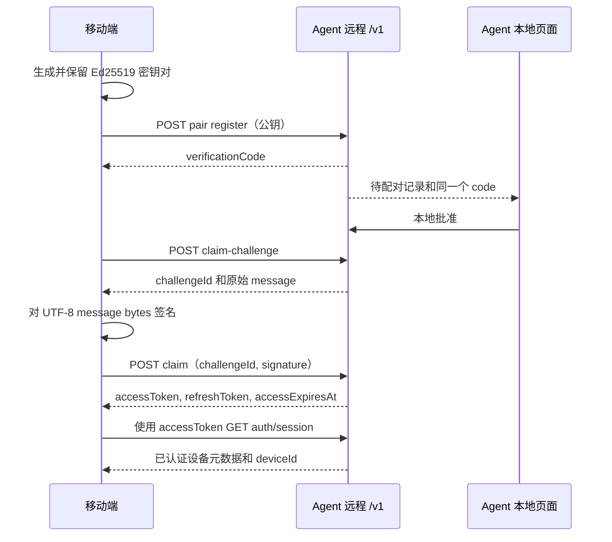
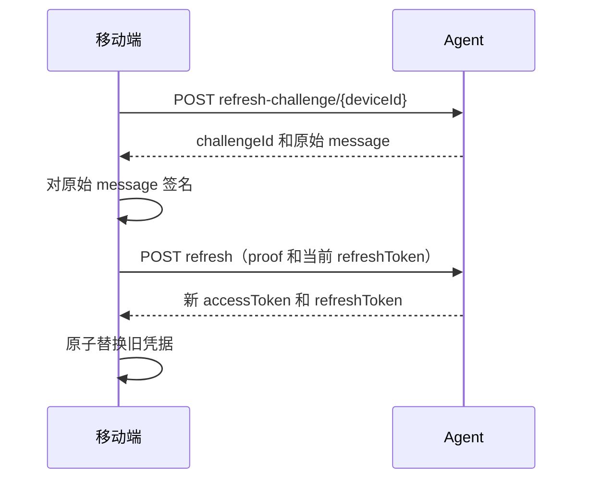
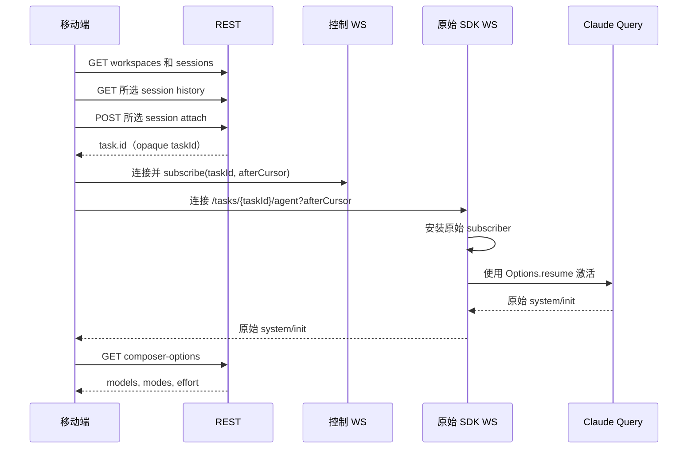
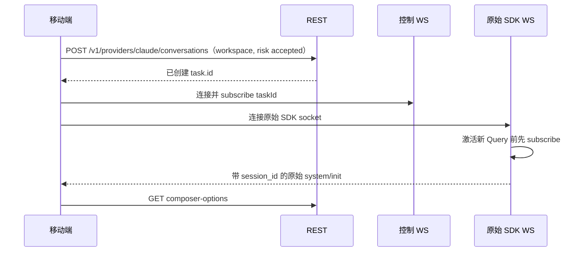
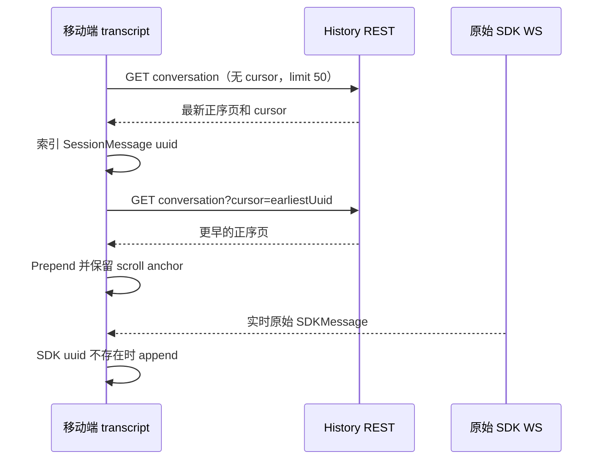
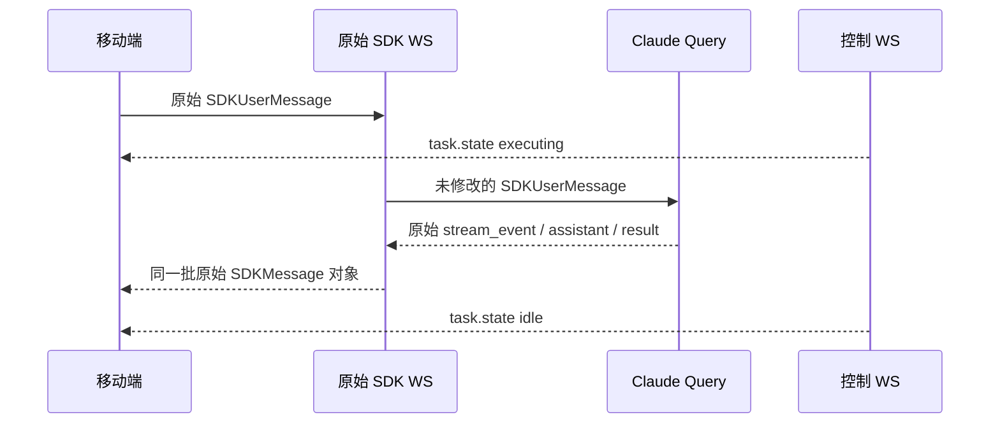
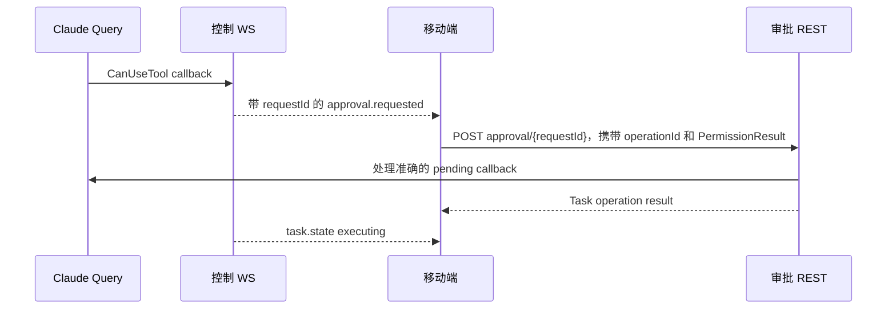
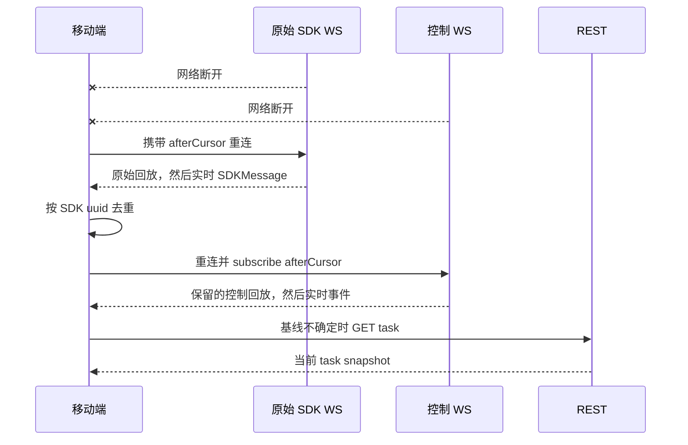
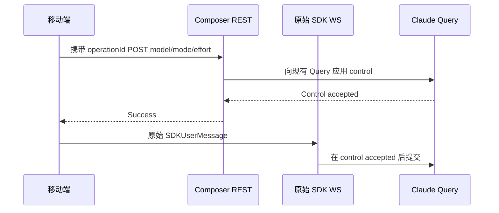
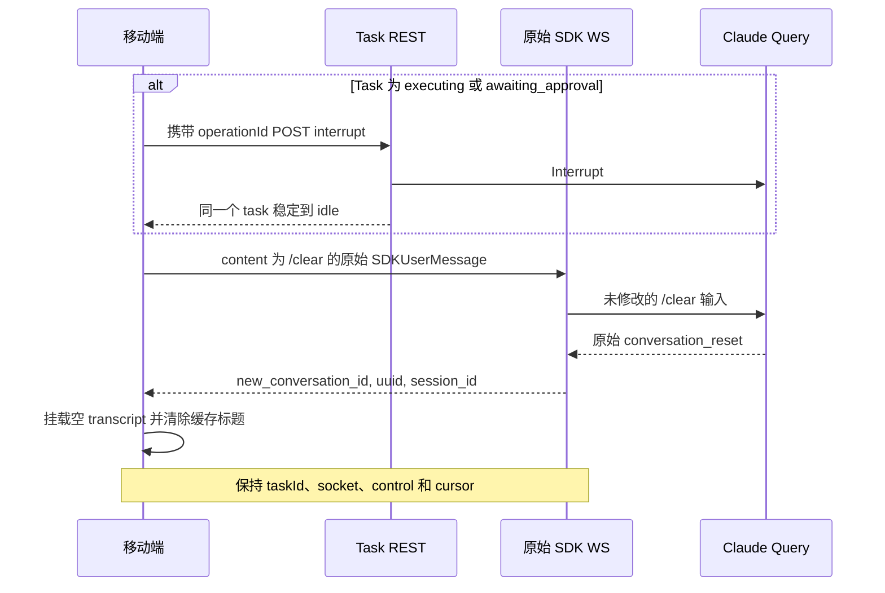

# PocketPilot 移动端接入指南

> **已验证契约：** PocketPilot 远程 API `/v1`、OpenAPI `3.1.0`
>（`info.version: 1.0.0`）、协议版本 `1`，以及
> `@anthropic-ai/claude-agent-sdk@0.3.210`；验证日期为 2026-07-18。
>
> **Schema 来源：** 运行中 Agent 的本地 Swagger UI
> `/documentation/`、原始 OpenAPI `/documentation/json`、随包发布的
> [`dist/openapi/mobile-v1.json`](../dist/openapi/mobile-v1.json)，以及已安装的
> Claude Agent SDK 类型声明。本指南解释工作流和数据所有权；字段定义仍以
> OpenAPI 和 SDK 类型为准。

## 1. 目的、受众、版本与事实来源

本指南适用于连接用户自有 PocketPilot Agent 的任何移动端客户端。内容包括配对、
认证、provider/工作区与会话发现、历史记录、实时会话传输、任务控制、审批、
重连、固定 Command 面板，以及同工作区新建对话行为。本指南不绑定任何平台。

当不同来源存在差异时，按以下优先级判断：

1. REST 和 PocketPilot 控制消息以当前运行时 Zod schema 和生成的 OpenAPI 为准。
2. 原始 `SDKUserMessage`、`SDKMessage`、`SessionMessage` 和
   `PermissionResult` 以 `@anthropic-ai/claude-agent-sdk@0.3.210` 类型声明为准。
3. 跨接口调用顺序和客户端状态所有权以本指南为准。

英文文件是规范源。
[`简体中文指南`](./mobile-integration-guide.zh-CN.md) 是它的严格翻译。即使 JSON
仍可解析，也不能直接认定后端或 SDK 升级兼容：移动端发布前必须根据 OpenAPI
重新生成 REST 绑定、复核固定版本 SDK 类型，并重新执行第 16 节的流程。

## 2. 不可破坏的边界与身份模型

### 2.1 协议边界

- PocketPilot 是本机 Agent provider 外层的认证传输和运行时控制器，不定义第二套
  会话协议，也不归一化 provider-native 消息。
- `/v1/tasks/{taskId}/agent` 是双向 provider-native stream。对于
  `provider: "claude"`，客户端帧是原始 `SDKUserMessage`，服务端帧是原始
  `SDKMessage`。对于 `provider: "codex"`，服务端流量是原生 Codex JSON-RPC，
  另加订阅时在保留原生回放前发送的一帧 `agent.checkpoint` 控制帧。
- `/v1/events` 只承载 PocketPilot 控制事件。即使包装在 `kind: "sdk"` 中，
  也绝不能通过该通道传输 SDK 消息。
- 历史记录行保持 provider-native。Claude 行是 SDK `SessionMessage` 对象；
  它们不是实时 `SDKMessage`，也不能重新转换为 prompt。
- 未知 SDK 字段和消息变体属于向前兼容数据。应安全保留或忽略，不能因为出现
  新变体而拒绝整个 session。

错误的 SDK 输出：

```json
{
  "kind": "sdk",
  "payload": {
    "kind": "assistant.stream-event",
    "message": { "type": "stream_event" }
  }
}
```

正确的 SDK 输出：

```json
{
  "type": "stream_event",
  "event": {
    "type": "content_block_delta",
    "index": 0,
    "delta": { "type": "text_delta", "text": "Working" }
  },
  "parent_tool_use_id": null,
  "uuid": "80000000-0000-4000-8000-000000000002",
  "session_id": "70000000-0000-4000-8000-000000000001"
}
```

PocketPilot 后端会为新建和恢复的 Agent SDK Query 默认设置
`includePartialMessages: true`。因此一次实时回复通常会先收到多个原始
`stream_event`（包括 `content_block_delta`），再收到完整的 `assistant` 消息。
移动端应立即合并增量，并在完整 `assistant` 到达时用其 `content[]` 校准最终内容；
不要自行伪造逐字动画，也不要把 SDK 消息包装成第二套协议。

### 2.2 身份标识表

| 标识符 | 所有者与用途 | 生命周期与客户端规则 |
| --- | --- | --- |
| `providerId` | 稳定的 provider path 标识，例如 `claude` | 从 `/v1/providers` 发现；不能通过本机文件推断支持情况，也不能写死可用状态。 |
| `conversationId` | provider-scoped REST path 使用的 provider-native 会话标识 | 对 Claude 来说，它是未修改 `SDKSessionInfo` 行中的 SDK session ID。 |
| `taskId` | PocketPilot 运行时/控制句柄，用于路由、状态、审批、回放、调度和一个存活 Query | 跨 turn 和 `conversation_reset` 保持不变。不能作为面向用户的对话身份。 |
| `sdkSessionId` / 原始 `session_id` | Claude 持久化与恢复身份 | 读取 SDK 提供的值。不能从 `taskId` 推导，也不能用重放历史记录替代。 |
| SDK `uuid` | SDK 历史/实时消息身份及 SDK 回放锚点 | 有值时用于历史/实时去重和 `afterCursor` 中的 provider-native 游标。合法实时消息可以没有该字段。 |
| `new_conversation_id` | 原始 `conversation_reset` 发出的新 transcript 边界 | 挂载全新 transcript 并清除缓存标题。不要更换 `taskId`，也不要假定它等于 `session_id`。 |
| `operationId` | 客户端为幂等 HTTP mutation 生成的 UUID | 每个不同 mutation 生成一次；仅重试同一 mutation 时复用。绝不能放入原始 SDK 帧。 |
| 审批 `requestId` | SDK 权限回调身份 | 只处理当前待审批请求。它与 HTTP `operationId` 无关。 |
| 控制 `cursor` | PocketPilot 控制事件回放位置 | 按 `taskId` 保存，并作为 `afterCursor` 发送。它与 SDK `uuid` 无关。 |

## 3. 传输概览与端到端流程

### 3.1 传输通道

| 接口面 | 方向 | 认证 | 内容 |
| --- | --- | --- | --- |
| `/v1/*` REST | 请求/响应 | 仅下文明确列出的接口公开；其余使用 `Authorization: Bearer <accessToken>` | 配对、发现、任务元数据、控制、审批 |
| `/v1/tasks/{taskId}/agent` | 双向 WebSocket | 握手时使用 Bearer header | provider-native 消息；当 `task.provider` 为 `claude` 时传输原始 `SDKUserMessage`/`SDKMessage`。Codex 还会在保留的原生回放前发送一帧订阅时 `agent.checkpoint` 控制帧；详见 Codex 移动端指南。 |
| `/v1/events` | 双向 WebSocket | 握手时使用 Bearer header | 订阅请求和 PocketPilot 控制事件，不含其他内容 |

打开 WebSocket 时转换 QR `baseUrl` 的 scheme：`https` 对应 `wss`，`http`
对应 `ws`。绝不能把访问凭据放入 URL、query string、日志、分析数据、崩溃报告或截图。

### 3.2 标准用户流程

1. 完成配对并保留设备密钥和轮换凭据。
2. 完成认证，调用 `GET /v1/providers`，并选择状态为 `available` 的 provider。
3. 读取 `/v1/providers/{providerId}/capabilities`，再调用 `GET /v1/workspaces`。
4. 选择已授权工作区，再调用
   `GET /v1/providers/{providerId}/conversations`。
5. 选择一个 provider-native 会话，或选择新建对话。
6. 对已有会话，加载最新一页历史记录用于展示。
7. attach 所选会话或创建会话运行时。在内部把返回的 `task.id` 保存为
   `taskId`；不要向用户展示单独的 task 步骤。
8. 打开 `/v1/events` 并订阅 `taskId`。
9. 打开 `/v1/tasks/{taskId}/agent`。服务端会先安装 native 订阅者，再激活新建或恢复的
   Query。
10. Agent socket 打开后，请求 composer options，并用原始 `system/init` 和
   `system/status` 消息校准状态。
11. 对 Claude，将普通 prompt 和 slash command 作为原始 `SDKUserMessage` 帧发送。

task 创建、选择和恢复都是内部传输细节，不应变成额外的会话页面。用户选择
Claude session 本身就是继续该会话的操作。

### 3.3 REST 操作清单

所有受保护操作都使用 `bearerAuth`。请求和响应字段详情必须从 OpenAPI 生成，
不能复制本表来定义。

| 区域 | Method 与 path | `operationId` | 访问方式/用途 |
| --- | --- | --- | --- |
| 配对 | `POST /v1/pair/{pairingId}/register` | `registerPairingDevice` | 公开 bootstrap；注册设备密钥 |
| 配对 | `POST /v1/pair/{pairingId}/claim-challenge` | `createPairingClaimChallenge` | 公开 bootstrap；本地批准后获取 proof challenge |
| 配对 | `POST /v1/pair/{pairingId}/claim` | `claimPairingCredentials` | 公开 bootstrap；领取首组凭据 |
| 认证 | `POST /v1/auth/refresh-challenge/{deviceId}` | `createRefreshChallenge` | 公开 bootstrap；获取 refresh proof challenge |
| 认证 | `POST /v1/auth/refresh` | `refreshCredentials` | 公开 bootstrap；轮换凭据 |
| 认证 | `GET /v1/auth/session` | `getAuthenticatedDeviceSession` | 受保护；验证访问凭据并读取设备元数据 |
| Providers | `GET /v1/providers` | `listAgentProviders` | 受保护；列出本机可用和不可用 provider |
| Providers | `GET /v1/providers/{providerId}/capabilities` | `getAgentProviderCapabilities` | 受保护；读取状态、native protocol version 和 capabilities |
| Conversations | `GET /v1/providers/{providerId}/conversations` | `listAgentConversations` | 受保护；列出工作区内的 provider-native 会话 |
| Conversations | `POST /v1/providers/{providerId}/conversations` | `createAgentConversation` | 受保护；创建空历史运行时 |
| Conversations | `GET /v1/providers/{providerId}/conversations/{conversationId}` | `readAgentConversation` | 受保护；读取 provider-native 历史页 |
| Conversations | `POST /v1/providers/{providerId}/conversations/{conversationId}/attach` | `attachAgentConversation` | 受保护；attach/复用会话运行时 |
| Tasks | `GET /v1/capabilities` | `getCapabilities` | 受保护；协议版本和权限模式 |
| Tasks | `GET /v1/workspaces` | `listAuthorizedWorkspaces` | 受保护；已配置的授权根目录 |
| Tasks | `GET /v1/tasks` | `listTasks` | 受保护；内部运行时元数据列表 |
| Tasks | `POST /v1/tasks` | `createTask` | 受保护；底层显式创建 task |
| Tasks | `GET /v1/tasks/{taskId}` | `getTask` | 受保护；刷新运行时状态 |
| Tasks | `POST /v1/tasks/{taskId}/interrupt` | `interruptTask` | 受保护 mutation；取消当前工作/审批 |
| Tasks | `POST /v1/tasks/{taskId}/close` | `closeTask` | 受保护 mutation；终止并关闭 |
| Tasks | `POST /v1/tasks/{taskId}/resume` | `resumeTask` | 受保护 mutation；恢复持久化的 interrupted task |
| Composer | `GET /v1/tasks/{taskId}/composer-options` | `getTaskComposerOptions` | 受保护；模型、模式和推理强度 |
| Composer | `POST /v1/tasks/{taskId}/model` | `setTaskModel` | 受保护 mutation；设置下一 turn 的模型 |
| Composer | `POST /v1/tasks/{taskId}/permission-mode` | `setTaskPermissionMode` | 受保护 mutation；设置权限模式 |
| Composer | `POST /v1/tasks/{taskId}/effort` | `setTaskEffort` | 受保护 mutation；设置下一 turn 的推理强度 |
| 审批 | `POST /v1/tasks/{taskId}/approvals/{requestId}` | `resolveTaskApproval` | 受保护 mutation；提交完整 SDK `PermissionResult` |
| Events | `GET /v1/events` | `subscribeTaskEvents` | 受保护 WebSocket upgrade |
| Agent Stream | `GET /v1/tasks/{taskId}/agent` | `streamTaskAgentMessages` | 受保护 provider-native WebSocket upgrade |

## 4. 配对、设备证明、凭据领取、刷新与撤销

### 4.1 配对与领取

电脑在本地创建并显示 QR。移动端只消费以下 payload，不能创建或修改它：

```json
{
  "version": 1,
  "agentId": "10000000-0000-4000-8000-000000000001",
  "baseUrl": "https://agent.example.test",
  "pairingId": "20000000-0000-4000-8000-000000000001",
  "expiresAt": 1784304300000
}
```

QR 五分钟后过期，且不包含 access 或 refresh credential。应在访问 Agent 之前拒绝
不支持的 `version`、无效 URL 或已过期 payload。

在设备上生成并保留 Ed25519 密钥对。发送原始 32-byte 公钥的 canonical、无 padding
base64url 编码：

```http
POST /v1/pair/20000000-0000-4000-8000-000000000001/register
Content-Type: application/json

{
  "deviceDisplayName": "Synthetic mobile device",
  "devicePublicKey": "AAAAAAAAAAAAAAAAAAAAAAAAAAAAAAAAAAAAAAAAAAA"
}
```

响应包含 `pairingId`、`expiresAt` 和六位 `verificationCode`。把该 code 展示给用户。
用户在 Agent 电脑上核对并批准同一个 code；移动端不能调用本地 `/admin/*` 批准接口。

本地批准后，请求 claim challenge。对返回的 `message` 字符串的原始 UTF-8 bytes
签名，不能先解析再重新序列化。

```http
POST /v1/pair/20000000-0000-4000-8000-000000000001/claim-challenge
```

```json
{
  "challengeId": "40000000-0000-4000-8000-000000000001",
  "expiresAt": 1784304300000,
  "message": "{\"agentId\":\"10000000-0000-4000-8000-000000000001\",\"challengeId\":\"40000000-0000-4000-8000-000000000001\",\"deviceId\":\"30000000-0000-4000-8000-000000000001\",\"expiresAt\":1784304300000,\"nonce\":\"AAAAAAAAAAAAAAAAAAAAAAAAAAAAAAAAAAAAAAAAAAA\",\"pairingId\":\"20000000-0000-4000-8000-000000000001\",\"purpose\":\"pairing_claim\",\"version\":1}",
  "nonce": "AAAAAAAAAAAAAAAAAAAAAAAAAAAAAAAAAAAAAAAAAAA"
}
```

```http
POST /v1/pair/20000000-0000-4000-8000-000000000001/claim
Content-Type: application/json

{
  "challengeId": "40000000-0000-4000-8000-000000000001",
  "signature": "AAAAAAAAAAAAAAAAAAAAAAAAAAAAAAAAAAAAAAAAAAAAAAAAAAAAAAAAAAAAAAAAAAAAAAAAAAAAAAAAAAAAAA"
}
```

以上所有值均为合成数据，无法用于认证。真实 signature 是 64-byte Ed25519
signature 的 canonical、无 padding base64url 编码。

成功领取后返回 `accessToken`、`accessExpiresAt` 和 `refreshToken`。立即用该
access credential 调用受保护的 `GET /v1/auth/session` 并保存设备 `id`；refresh
challenge URL 需要这个 `deviceId`。如果 claim 响应丢失，应在配对过期前请求新的
claim challenge 并再次领取；Agent 会先替换未送达的凭据链。

### 4.2 凭据规则

- Access credential 一小时后过期。Refresh credential 在连续三十天未使用后过期。
- 两者都视为 opaque string，绝不能解析其内部 `ppat.*` 或 `pprt.*` 格式。
- 使用设备保护的凭据存储保存私钥、access credential、refresh credential、
  device ID 和 Agent identity。私钥绝不能离开设备。
- 所有受保护 HTTP 请求和两个 WebSocket 握手都使用
  `Authorization: Bearer <accessToken>`。
- 应用启动、恢复凭据或网络恢复状态不确定后，用 `GET /v1/auth/session` 验证访问状态。

### 4.3 Refresh 轮换

1. 调用 `POST /v1/auth/refresh-challenge/{deviceId}`。
2. 使用同一个 Ed25519 私钥对返回的 `message` 原始 bytes 签名。
3. 调用 `POST /v1/auth/refresh`，提交 `challengeId`、`signature` 和当前
   `refreshToken`。
4. 仅在成功响应后，原子替换本地保存的两项凭据。不能继续使用前一项 refresh
   credential。

```json
{
  "challengeId": "40000000-0000-4000-8000-000000000002",
  "signature": "AAAAAAAAAAAAAAAAAAAAAAAAAAAAAAAAAAAAAAAAAAAAAAAAAAAAAAAAAAAAAAAAAAAAAAAAAAAAAAAAAAAAAA",
  "refreshToken": "pprt.30000000-0000-4000-8000-000000000001.synthetic-refresh-secret"
}
```

已被替换的 refresh credential 一旦通过验证，将返回 `REFRESH_TOKEN_REUSED`、撤销
设备，并以 `4003` 关闭该设备的全部 socket。此时应删除本地凭据并要求重新配对。
`DEVICE_REVOKED`、`ACCESS_TOKEN_REVOKED` 或本地确认撤销时执行相同恢复流程。
Access token 过期后可刷新；refresh token 过期后必须重新配对。

## 5. 已授权工作区与 Claude Session 发现

`GET /v1/workspaces` 只返回用户在 Agent 电脑上配置的根目录：

```json
{
  "workspaceRoots": ["D:\\Projects\\demo-app", "D:\\Projects\\sample-api"]
}
```

空数组是合法结果，表示电脑用户尚未授权工作区。移动端不能新增、删除、浏览或推断
目录，应提示用户在电脑本地完成配置。

所有 session 操作都携带所选 `workspace`。Agent 会再次 canonicalize 并检查当前
授权。创建或 attach 运行时的操作中，`workspaceRiskAccepted: true` 表示用户接受
工作目录的作用范围。授权根目录只约束初始 `cwd`；它不是 Claude 或其工具的
filesystem sandbox。

使用统一 cursor 外壳列出 provider-native 会话：

```http
GET /v1/providers/claude/conversations?workspace=D%3A%5CProjects%5Cdemo-app&limit=50
Authorization: Bearer <accessToken>
```

响应为 `{ conversations: SDKSessionInfo[], page: { cursor, hasMore } }`。数据行归
SDK 所有，未来可能增加字段。对 Claude，`page.cursor` 内含 SDK catalog 使用的下一个
offset；只要 `page.hasMore` 为 true 就把它作为 `cursor` 继续请求，即使某一页经过
workspace policy 过滤后 `conversations` 数组为空。Worktree 不包含在结果中；
programmatic session 包含在结果中。

对已有 session，在历史和 attach 请求中使用其 `sessionId`。没有活动 Query 时，
新建对话应调用：

```json
{
  "operationId": "50000000-0000-4000-8000-000000000001",
  "workspace": "D:\\Projects\\demo-app",
  "workspaceRiskAccepted": true
}
```

并发送到 `POST /v1/providers/claude/conversations`。Claude Code 自行解析模型、权限和推理强度默认值。
正常用户流程不能使用底层 `POST /v1/tasks`。

## 6. 历史分页与 Transcript 所有权

### 6.1 最新页与更早页

不带 `cursor` 请求最新页：

```http
GET /v1/providers/claude/conversations/70000000-0000-4000-8000-000000000001?workspace=D%3A%5CProjects%5Cdemo-app&limit=50&includeSystemMessages=false
Authorization: Bearer <accessToken>
```

Agent 返回未修改且按时间正序排列的 `SessionMessage` 行；一页内从最早到最新：

```json
{
  "messages": [
    {
      "type": "assistant",
      "uuid": "80000000-0000-4000-8000-000000000001",
      "session_id": "70000000-0000-4000-8000-000000000001",
      "message": {
        "role": "assistant",
        "content": [{ "type": "text", "text": "Synthetic response" }]
      },
      "parent_tool_use_id": null,
      "parent_agent_id": null
    }
  ],
  "page": {
    "cursor": "80000000-0000-4000-8000-000000000001",
    "hasMore": true
  }
}
```

每页最多 50 条消息。`page.hasMore` 为 true 时，把返回的 `page.cursor` 作为下一次
请求的 `cursor`，加载更早一页并 prepend 到现有列表。对 Claude，该 cursor 是 SDK
消息 UUID。在同一条 cursor 链上必须保持 `includeSystemMessages` 不变。Claude
会声明 `capabilities.historyFilters.includeSystemMessages: true` 并真正应用该
过滤条件。Codex 会声明 `false`，并对 `includeSystemMessages=true` 返回
`409 HISTORY_FILTER_NOT_SUPPORTED`；省略或 `false` 则原样返回原生行。收到
`HISTORY_CURSOR_STALE` 时，丢弃当前分页链，不带 `cursor` 重新加载最新页。

SDK 目前会为每一页重新解析本地 transcript。分页限制的是网络和渲染开销，而不是
电脑侧解析开销。同一个 session 的多次加载应串行执行，避免推测性突发请求，并对
很长的 transcript 使用虚拟化渲染。

### 6.2 历史/实时交接

| 来源 | 类型 | 放置方式 | 身份规则 |
| --- | --- | --- | --- |
| History REST | `SessionMessage` | 初始正序列表；prepend 更早页 | 必有 `uuid` |
| 原始 SDK WebSocket | `SDKMessage` | 按到达顺序 append 实时事件 | 存在 `uuid` 时，与历史行和实时行去重 |

保留原始 source object，或保留能指回原始对象的无损渲染 projection。不能把两个
union 都压平成 PocketPilot wire type。交接时，先建立已加载历史 UUID 集合；只有
实时帧的 SDK UUID 已存在时才丢弃它，并记录新 append 的 UUID。没有 UUID 的消息
仍然合法，必须按到达顺序渲染。

绝不能把已加载历史重新发到 SDK socket。Claude Code 通过 `Options.resume` 恢复
上下文；移动端 transcript 是一个视图，不是第二份 canonical transcript。

## 7. 内部 Task Attach、创建与状态

加载历史后或与历史并行，为所选 session 执行 attach：

```http
POST /v1/providers/claude/conversations/70000000-0000-4000-8000-000000000001/attach
Authorization: Bearer <accessToken>
Content-Type: application/json

{
  "operationId": "50000000-0000-4000-8000-000000000002",
  "workspace": "D:\\Projects\\demo-app",
  "workspaceRiskAccepted": true
}
```

响应 action 为 `attached`，并包含 task snapshot。Agent 会复用已 attach 到同一个
`sdkSessionId` 的唯一非 terminal task，因此用户重复选择时可能得到相同的
`task.id`。应把该 ID 保存为 opaque runtime handle。

对 `POST /v1/providers/claude/conversations`，响应 action 为 `created`，`sdkSessionId` 初始值为
`null`，之后由原始 SDK 消息确定。Session-centric task snapshot 使用
`origin: "claude-session"`、`model: null` 和 `permissionMode: null`，因为
Claude Code 拥有恢复值/默认值。

### 7.1 状态模型

| 状态 | 含义 | 移动端行为 |
| --- | --- | --- |
| `idle` | Query 可以接收新 turn | 启用 Send、composer control、新建对话和 Close。无需 Interrupt，但调用后也会安全回到 idle。 |
| `executing` | 一个或多个会触发 query 的输入正在执行 | 渲染实时 SDK 输出。仍允许 Send；control 作用于下一 turn。提供 Interrupt 和 Close。 |
| `awaiting_approval` | SDK 工具权限回调等待处理 | 展示审批；仍允许 Send 和 control。提供 Resolve、Interrupt 和 Close。 |
| `interrupted` | 持久化恢复状态或短暂中断过渡状态 | 不使用原始 socket。正常页面流程应重新 attach 所选 Claude session；仅当存在 `sdkSessionId` 时，底层恢复流程才使用 `resumeTask`。 |
| `terminal` | 运行时已永久关闭 | 停止重连该 task。返回 session 发现并 attach/create 另一个运行时。 |

显式 interrupt 会发布 `interrupted`、取消工作/审批，然后在 HTTP 响应完成前让同一个
Query/session 回到 `idle`；除非并发 P0 close 已将其设为 terminal。进程重启可能留下
持久化 `interrupted` 行。控制事件回放无法确定当前基线时，刷新
`GET /v1/tasks/{taskId}`。

## 8. 原始 Claude SDK WebSocket

打开：

```text
wss://agent.example.test/v1/tasks/60000000-0000-4000-8000-000000000001/agent
Authorization: Bearer <accessToken>
```

重连时可追加 `?afterCursor=<providerCursor>`。WebSocket route 会先订阅原始消息，再激活
新建/恢复的 session-centric Query，因此不会漏掉最初的 `system/init`。不要增加
单独的激活请求。

### 8.1 客户端帧

最小原始 `SDKUserMessage` 为：

```json
{
  "type": "user",
  "message": {
    "role": "user",
    "content": "Summarize the pending changes."
  },
  "parent_tool_use_id": null,
  "origin": { "kind": "human" },
  "uuid": "80000000-0000-4000-8000-000000000010",
  "timestamp": "2026-07-18T10:00:00.000Z",
  "priority": "now"
}
```

`uuid`、`session_id`、`origin`、`timestamp`、`priority` 和 `shouldQuery`
都是 SDK 所有的可选字段。不能在本地要求它们必填，也不能向帧中加入 `taskId` 或
`operationId`。构造直接人类输入时，`origin: { "kind": "human" }` 符合固定版本
SDK 的 provenance 契约。原样保留 `priority: "now" | "next" | "later"` 和
`shouldQuery`。`shouldQuery: false` 会追加上下文而不触发 assistant turn。

### 8.2 服务端帧

所有服务端帧都是原始、开放的 `SDKMessage` 变体。有效初始化示例为：

```json
{
  "type": "system",
  "subtype": "init",
  "apiKeySource": "oauth",
  "claude_code_version": "2.1.0-synthetic",
  "cwd": "D:\\Projects\\demo-app",
  "tools": ["Read", "Edit"],
  "mcp_servers": [],
  "model": "claude-sonnet-4-5",
  "permissionMode": "default",
  "slash_commands": ["compact", "context", "usage"],
  "output_style": "default",
  "skills": [],
  "plugins": [],
  "uuid": "80000000-0000-4000-8000-000000000011",
  "session_id": "70000000-0000-4000-8000-000000000001"
}
```

以原始 `system/init` 和 `system/status` 作为当前模型、权限模式和 SDK 状态的
权威来源。assistant、user、stream、result、system、tool、local-command、compact
以及未来变体都直接渲染，不添加 PocketPilot wrapper。

完整的原始 SDK 消息类型、JSON 示例、流式拼接和移动端渲染策略见
[`Claude Code / Agent SDK 原始消息类型说明`](./claude-sdk-message-types.zh-CN.md)。

### 8.3 SDK 回放与重连

- 存在 UUID 时，按 `taskId` 保存最后一个已处理 SDK UUID。
- 已知 `afterCursor` 会回放其后的已保留消息，然后继续实时传输。
- 缺少或无法识别的 `afterCursor` 会从当前 turn 起点回放已保留消息。按 UUID 去重。
- 回放只保留活动 turn，并在 turn 结束、terminal 清理、shutdown 和安全启动时删除。
  在 idle 状态重连可能没有可回放数据。
- 没有 UUID 的消息也会投递和保留，但不能作为 `afterCursor` 锚点。
- Socket 断开绝不会中断 Claude。使用相同 `taskId` 重连；不能仅因网络变化创建 task。

稳定 close code 见第 14 节。原始 socket 绝不发送 PocketPilot JSON error frame。

## 9. PocketPilot 控制 WebSocket

携带 Bearer header 打开 `/v1/events`，然后发送一个订阅：

```json
{
  "type": "subscribe",
  "taskId": "60000000-0000-4000-8000-000000000001",
  "afterCursor": -1
}
```

初始 cursor 为 `-1`。同一 socket 上的新订阅会替换之前的 task 订阅。由于订阅期间
会立即执行回放，保留事件可能先于 `subscribed` acknowledgement 到达。

```json
{
  "type": "subscribed",
  "taskId": "60000000-0000-4000-8000-000000000001",
  "afterCursor": -1
}
```

控制事件只有一层 PocketPilot envelope：

```json
{
  "type": "event",
  "event": {
    "cursor": 12,
    "taskId": "60000000-0000-4000-8000-000000000001",
    "occurredAt": 1784304000000,
    "event": {
      "kind": "task.state",
      "payload": { "state": "executing" }
    }
  }
}
```

已知控制 kind 为：

| `event.event.kind` | Payload | 操作 |
| --- | --- | --- |
| `task.state` | `{ state }` | 校准 task control 和状态 |
| `approval.requested` | `{ toolName, input, options }` | 展示并处理当前 SDK 权限请求 |
| `event.replay-storage-limit-reached` | `{ code: "EVENT_REPLAY_STORAGE_LIMIT_REACHED" }` | 继续实时传输；标记回放不完整，并在重连后恢复基线 |

未知的未来控制 kind 不能解释为 SDK 消息。错误的订阅会收到
`{ "type": "error", "code": "EVENT_SUBSCRIPTION_INVALID" }`；修正请求后在
同一个 socket 上重新订阅。

按 task 保存已处理的最大 `cursor`。重连时将其作为 `afterCursor` 发送；Agent 会先
回放 cursor 更大的活动 turn 控制事件。控制回放与上文活动 turn 生命周期相同。
出现缺口后，通过 `GET /v1/tasks/{taskId}` 获取当前状态；本地仍显示的审批应视为
stale，直到收到当前 `approval.requested`。Task close/root revocation 会关闭该 task
的原始 SDK socket，但设备控制 socket 仍可用。设备撤销会以 `4003` 同时关闭两者。

## 10. Composer 初始化、控制与 Send 顺序

原始 SDK socket 打开后，调用 `GET /v1/tasks/{taskId}/composer-options`。
在 session 建立前调用会返回 `TASK_SESSION_UNAVAILABLE`。

响应包含：

| 字段 | 用途 |
| --- | --- |
| `models[]` | SDK `ModelInfo` 行。展示 `displayName`，提交 `value`。保留未知字段。 |
| `models[].supportedEffortLevels` | 提供该字段时，表示该模型可用的推理强度选项 |
| `supportedPermissionModes[]` | 固定版本 SDK 支持的全部权限模式 |
| `effortLevel` | 解析得到的初始推理强度，或 `null` |

当前固定版本的权限模式为 `default`、`acceptEdits`、`bypassPermissions`、`plan`、
`dontAsk` 和 `auto`。应把接口响应作为运行时 catalog，不能只依赖硬编码。API
effort union 为 `low`、`medium`、`high`、`xhigh` 和 `max`；selector 应限制为
所选模型公开的 levels。

Control 修改现有 Query，并作用于下一 turn：

```json
{
  "operationId": "50000000-0000-4000-8000-000000000010",
  "model": "claude-sonnet-4-5"
}
```

发送到 `POST /v1/tasks/{taskId}/model`；

```json
{
  "operationId": "50000000-0000-4000-8000-000000000011",
  "permissionMode": "plan"
}
```

发送到 `POST /v1/tasks/{taskId}/permission-mode`；以及

```json
{
  "operationId": "50000000-0000-4000-8000-000000000012",
  "effortLevel": "high"
}
```

发送到 `POST /v1/tasks/{taskId}/effort`。`effortLevel: null` 清除 live flag
layer 的 effort override。省略 `model` 表示在 control 支持时要求 SDK 清除显式模型选择。

当某项 control 必须作用于下一条 prompt 时，应等待其 HTTP 成功响应，再发送原始
user frame。不能把 model、permission 或 effort 字段附加到 `SDKUserMessage`。
活动 turn 期间仍允许 control，但它们作用于下一 turn。应使用原始
`system/init`/`system/status` 校准已接受的请求，不能自行合成这些 SDK 消息。

每项不同 control 都要生成新的 `operationId`。对完全相同 control 的网络重试应复用
原 ID。绝不能把同一个 operation ID 用于另一个 endpoint 或 value。

## 11. 审批、Interrupt、Close、断开与运行时优先级

### 11.1 审批生命周期

审批只会通过 `/v1/events` 到达：

```json
{
  "type": "event",
  "event": {
    "cursor": 13,
    "taskId": "60000000-0000-4000-8000-000000000001",
    "occurredAt": 1784304000100,
    "event": {
      "kind": "approval.requested",
      "payload": {
        "toolName": "Edit",
        "input": { "file_path": "D:\\Projects\\demo-app\\README.md" },
        "options": {
          "title": "Claude wants to edit README.md",
          "displayName": "Edit file",
          "description": "Claude will update a synthetic project file.",
          "toolUseID": "toolu_synthetic_01",
          "requestId": "req_synthetic_01",
          "suggestions": []
        }
      }
    }
  }
}
```

Agent 会转发所有可序列化 `CanUseTool` option：`suggestions`、`blockedPath`、
`decisionReason`、`title`、`displayName`、`description`、`toolUseID`、`agentID`、
`requestId` 和未来扩展字段。SDK `AbortSignal` 保留在电脑上，绝不序列化。优先使用
给定的 `title`、`displayName` 和 `description`，不要根据 tool input 重建权限文案。

使用完整 SDK `PermissionResult` 处理准确的 `options.requestId`：

```http
POST /v1/tasks/60000000-0000-4000-8000-000000000001/approvals/req_synthetic_01
Authorization: Bearer <accessToken>
Content-Type: application/json

{
  "operationId": "50000000-0000-4000-8000-000000000020",
  "result": {
    "behavior": "allow",
    "updatedInput": { "file_path": "D:\\Projects\\demo-app\\README.md" },
    "updatedPermissions": [],
    "toolUseID": "toolu_synthetic_01",
    "decisionClassification": "user_temporary"
  }
}
```

拒绝时发送 `behavior: "deny"`、用户可安全阅读的 `message`，以及所选的
`interrupt`、`toolUseID` 和 `decisionClassification` 字段。实现“始终允许”时，
把所选 SDK `suggestions` 完整放入 `updatedPermissions` 返回；不要另造记住选择字段。

同一时刻只有一个审批有效。新请求、interrupt、close、abort、replacement 或
shutdown 都会取消旧回调。收到 `STALE_APPROVAL` 时，关闭过期提示并刷新 task 状态；
绝不能把该决定用于另一个请求。

### 11.2 断开、interrupt 与 close

| 操作 | 效果 |
| --- | --- |
| 网络断开 | 不改变 task 状态，也不取消工作。分别重连两个传输通道。 |
| `POST /v1/tasks/{taskId}/interrupt` | P1 取消当前工作和审批；保留 Query/session，并在响应前回到 `idle` |
| `POST /v1/tasks/{taskId}/close` | P0 取消；设为 `terminal`，以 `4009` 关闭原始 task socket，且不可恢复 |
| 本地删除根目录 | 受影响 task 执行 P0 terminalization；控制 socket 保持连接 |
| Agent shutdown | 对全部非 terminal task 执行 P0 terminalization |

只有用户明确要丢弃运行时句柄时才使用 Close。离开页面或连接丢失不等于 Close 或
Interrupt。

### 11.3 PocketPilot 优先级与 SDK 调度

| 运行时等级 | 操作 | 抢占行为 |
| --- | --- | --- |
| P0 | Shutdown、close、授权根目录撤销 | 立即执行 terminal policy；使较早排队的 P2 工作失效 |
| P1 | Interrupt | 立即执行 cancellation policy；使较早排队的 P2 工作失效，然后让同一个运行时稳定下来 |
| P2 | 原始 Send、审批、model/mode/effort、activation、composer、resume | 串行处理，保证确定性 handoff 和 control-before-Send 顺序 |
| P3 | Session catalog、history、status 和 configuration read | 可能等待更高优先级 policy，并且返回前必须重新检查当前授权 |

被 P0/P1 取代的 HTTP mutation 可能返回 `TASK_OPERATION_SUPERSEDED`；使用相同
`operationId` 重试会再次得到同一个 tombstone error。开始新 mutation 前应重新确认
用户意图。

该 P0-P3 policy 与原始 SDK `priority: "now" | "next" | "later"` 和
`shouldQuery` 无关。应原样转发这些字段。PocketPilot 不重新解释 Claude 调度。

## 12. 固定 Command 面板与原始 Slash 提交

Command 按钮是发现面板，不是执行 API 或 allowlist。它只包含以下八个主条目：

| Command | 参数 UI | 构造的 content |
| --- | --- | --- |
| `/compact` | 可选自定义摘要说明 | `/compact` 或 `/compact <instructions>` |
| `/context` | 无 | `/context` |
| `/usage` | 无 | `/usage` |
| `/rename` | 可选对话名称 | `/rename` 或 `/rename <name>` |
| `/recap` | 无 | `/recap` |
| `/review` | 可选 GitHub pull-request number | `/review` 或 `/review <pr number>` |
| `/security-review` | 无 | `/security-review` |
| `/code-review` | 可选 effort selector：default、`low`、`medium`、`high`、`xhigh`、`max`；可选 target text | `/code-review [effort] [target]` |

不要增加 alias 条目 `/cost` 或 `/stats`（`/usage` 的 alias），也不要增加 `/name`
（`/rename` 的 alias）。`/code-review` 面板不能提供 `ultra`、`--fix` 或
`--comment`。用户仍可手动输入任何原始 slash command，包括这些值，并且必须原样
传给 Claude。

在本地构造所选 command，只去除为空的可选片段，把结果字符串放入普通
`message.content`，再通过原始 SDK socket 发送：

```text
parts = [command]
if effort is selected: parts.append(effort)
if target is non-empty: parts.append(target)
content = join(parts, " ")
sendRawSdkUserMessage(content)
```

```json
{
  "type": "user",
  "message": {
    "role": "user",
    "content": "/code-review high src/remote-api"
  },
  "parent_tool_use_id": null,
  "origin": { "kind": "human" },
  "uuid": "80000000-0000-4000-8000-000000000030"
}
```

不存在 slash-command REST endpoint。Command 与其他原始 user message 使用相同的
idle、executing、awaiting-approval、priority 和 queuing 行为。渲染原始 SDK
`system/informational`、`system/local_command_output`、
`system/compact_boundary`、result 和未来 command 消息。如果 Claude 报告 command
不可用，应展示该 SDK-owned 输出并保持 composer 可用；不能转换为 HTTP failure。

## 13. 同工作区新建对话与 `conversation_reset`

`/clear`、`/reset` 和 `/new` 不是 Command 面板条目，而属于专用的新建对话操作。

当前运行时存在活动 Query 时：

1. 如果 task 状态为 `executing` 或 `awaiting_approval`，调用 Interrupt，并等待
   HTTP 响应/当前状态稳定到 `idle`。`/clear` 本身不表示 Interrupt。
2. 在同一个 task socket 上把 `/clear` 作为普通原始 SDK user content 发送。
3. 等待原始 SDK `conversation_reset`；绝不能由客户端模拟。
4. 收到后，在 `new_conversation_id` 下挂载空 transcript，清除展示标题和当前
   transcript cache，并让旧 transcript 继续可通过常规 session 发现/history 访问。
5. 保持 `taskId`、Query、SDK socket、control socket、composer control、审批所有权和
   event cursor。后续继续在同一个运行时发送。

```json
{
  "type": "conversation_reset",
  "new_conversation_id": "a0000000-0000-4000-8000-000000000001",
  "uuid": "90000000-0000-4000-8000-000000000001",
  "session_id": "70000000-0000-4000-8000-000000000002"
}
```

把该消息作为一个原始 `SDKMessage` 处理。不能包装它、更换 task connection，
也不能假定 `new_conversation_id` 与 `session_id` 是同一个身份。Agent 会读取 SDK
`session_id` 用于后续持久化。

如果不存在活动 Query/runtime，应在所选 workspace 使用 `POST /v1/providers/claude/conversations`
新建对话，而不是为了发送 `/clear` 临时创建 task。

## 14. 错误与 Close Code 恢复

所有 REST domain error 都使用稳定的 `{ "code": string, "message": string }`
结构。按 `code` 分支处理；`message` 只作为用户可安全阅读的上下文展示。

| 条件/code | 常见 status | 必需恢复行为 |
| --- | --- | --- |
| `ACCESS_TOKEN_EXPIRED` | 401 | 暂停受保护调用，通过 refresh challenge 流程轮换，然后重试一次 |
| `ACCESS_TOKEN_INVALID`, `ACCESS_TOKEN_REVOKED`, `DEVICE_REVOKED` | 401 | 清除访问状态；仅当 refresh 仍有效时刷新，否则重新配对 |
| `REFRESH_TOKEN_EXPIRED`, `REFRESH_TOKEN_INVALID` | 401 | 清除凭据并重新配对 |
| `REFRESH_TOKEN_REUSED` | 401 | 安全事件：清除凭据、关闭本地 socket、重新配对 |
| `PAIRING_*`, `CHALLENGE_*`, `DEVICE_PROOF_INVALID` | 401/404/409/410 | 回到正确配对步骤；绝不能复用已消费/过期 challenge |
| `WORKSPACE_SCOPE_RISK_NOT_ACCEPTED` | 422 | 获取明确的 scope acceptance，再发起新 operation |
| `WORKSPACE_NOT_AUTHORIZED` | 403 | 重新加载 `/v1/workspaces`；由用户在电脑上修改授权 |
| `CLAUDE_SESSION_NOT_FOUND` | 404 | 删除 stale 行并重新加载 session 列表，不暴露其他路径 |
| `CLAUDE_HISTORY_UNAVAILABLE` | 409 | 保持已 attach Query/composer 可用；使用 backoff 重试 history |
| `HISTORY_CURSOR_STALE` | 409 | 丢弃旧页 cursor 链并重新加载最新 history |
| `HISTORY_FILTER_NOT_SUPPORTED` | 409 | 去掉不支持的过滤条件；发送前先读取 `capabilities.historyFilters` |
| `CONCURRENT_TASK_LIMIT_REACHED` | 409 | 不要循环重试；等待活动工作结束，或由用户关闭工作 |
| `TASK_NOT_FOUND` | 404 | 停止重连该 handle；重新执行 session discovery/attach |
| `TASK_INTERRUPTED` | 409 | 重新 attach 所选 session，或执行显式底层 resume |
| `TASK_SESSION_UNAVAILABLE` | 409 | 等待 interrupt 清理或重新 attach；不能自动重放 prompt |
| `TASK_TERMINAL` | 409 | 停止使用 `taskId`；attach/create 另一个运行时 |
| `TASK_BUSY` | 409 | 刷新 task 状态；仅对真正 interrupted task 使用 resume |
| `STALE_APPROVAL` | 409 | 关闭审批提示并等待当前 approval event |
| `UNSUPPORTED_PERMISSION_MODE` | 422 | 刷新 capabilities/composer options，并删除 stale selection |
| `INVALID_TASK_OPERATION` | 422 | 修正客户端 payload；不能盲目重试 |
| `TASK_OPERATION_SUPERSEDED` | 409 | 不能把 tombstone operation 用于新意图；刷新状态 |
| `EVENT_REPLAY_STORAGE_LIMIT_REACHED` | 控制事件 | 继续实时传输；重连后刷新 task/history 基线，因为缺口无法回放 |
| Command unavailable | 原始 SDK 输出 | 渲染 SDK 消息；保持传输和 composer 活动 |

### 14.1 WebSocket close code

| Socket | Code/reason | 恢复行为 |
| --- | --- | --- |
| 原始 SDK | `4000 SDK_MESSAGE_INVALID` | 客户端 bug：检查发出的原始 frame；不要原样重发 |
| 两者 | `4003 AUTHENTICATION_FAILED` 或设备撤销 reason | 刷新/验证凭据；撤销后重新配对 |
| 原始 SDK | `4004 TASK_NOT_FOUND` | 停止重连 task；重新 attach/create |
| 原始 SDK | `4009 TASK_SESSION_UNAVAILABLE` | 刷新 task；除非 terminal，否则等待/重新 attach |
| 原始 SDK | `4011 SDK_TRANSPORT_FAILED` | Backoff，刷新 task 状态，使用最后的 `afterCursor` 重连；绝不能自动重发 prompt |

控制 socket 还会在不关闭连接的情况下发送
`EVENT_SUBSCRIPTION_INVALID` JSON 消息。两个 socket 都不使用 SDK-error wrapper。
网络/`4011` 重连使用带 jitter 的有界指数 backoff；认证和 terminal error 需要修复状态，
不能无限循环重试。

## 15. 安全与数据处理边界

- QR 承载 locator 和短期配对元数据，不承载 credential。
- 移动设备拥有自己的 Ed25519 私钥和轮换 opaque credential。绝不能通过应用分析
  或通用 preferences 同步这些数据。
- 当连接路径未由用户控制的加密网络保护时，使用 TLS（`https`/`wss`）。根据本地
  配置，PocketPilot 自身可能以明文 HTTP/WS 提供服务。
- 绝不能在日志和分析中暴露 access/refresh credential、Claude credential、
  Claude settings 内容、prompt、模型输出、tool input 或本地 path。
- PocketPilot 公开已配置授权根目录和 SDK-owned session 数据；它不公开 Claude
  credential 或任意 settings file。
- 授权根目录允许初始 `cwd` 和 session selection。它们不是 filesystem sandbox，
  也不限制已经批准的 Claude tool 能访问哪些位置。
- 把 tool approval `input` 和全部 transcript 内容作为敏感用户数据，只能在当前
  已认证设备上下文中渲染。
- 分别使用有类型的字段和存储保存 REST `operationId`、control cursor、SDK UUID、
  approval request ID、task ID 和 Claude session ID。
- 不要持久化第二份 canonical transcript，也不要把 history 作为 prompt context
  发送。Agent 本身只存 task/session 元数据，不存 SDK 内容。

## 16. 实现时序与验收清单

以下图表是规范性顺序摘要。不支持 Mermaid 的 renderer 应以相邻文字步骤为准。

### 16.1 配对并领取凭据

扫描 QR、注册设备密钥、在本地核对 code、获取 challenge、对原始 message 签名，
然后领取并保存 credential。



### 16.2 刷新轮换凭据

获取新的 one-time challenge，完成签名，使用当前 refresh credential 轮换，
然后原子替换本地保存的凭据对。



### 16.3 打开已有 Session

列出并选择 session，开始加载历史记录，执行 attach，连接控制通道，再连接原始 SDK。
服务端会在激活 Query 前订阅原始消息。只有原始连接打开后才请求 composer options。



### 16.4 创建新对话

先创建内部运行时，再使用相同的 subscribe-before-activate 顺序。不发起 history 请求。



### 16.5 历史分页与实时交接去重

展示最新正序页，prepend 更早页，仅在 SDK UUID 尚未加载时 append 实时帧。



### 16.6 Send 并渲染实时输出

发送一个原始 SDK 对象。到达时 append 原始 SDK 输出；控制状态从另一个 socket 读取。



### 16.7 处理审批

接收控制请求、收集决定，并使用 SDK request ID 和单独的 HTTP operation ID POST
完整 `PermissionResult`。



### 16.8 分别重连两个 Socket

分别保留两个锚点。SDK 回放要去重；控制回放无法提供完整基线时，通过 REST 刷新状态。



### 16.9 在 Send 前应用 Control

发送前等待 mutation 响应。只收到 WebSocket 消息并不能建立 HTTP control 顺序。



### 16.10 在同工作区新建对话

只有工作/审批活动时才 interrupt，等待稳定后发送原始 `/clear`，仅在收到 SDK reset
event 后切换 transcript。保留运行时和 socket。



### 16.11 移动端验收清单

- [ ] 配对对原始 challenge `message` 签名，且绝不在 QR 数据中放入 credential。
- [ ] Access 和 refresh 轮换是原子的；reuse/revocation 会清理设备状态和 socket。
- [ ] 只展示本地授权的 workspace；正确处理空 roots。
- [ ] 选择 session 后加载正序 history，并透明 attach。
- [ ] 长 history 使用虚拟化，更早页 prepend，stale cursor 触发重新加载最新页。
- [ ] History `SessionMessage` 与实时 `SDKMessage` 保持不同，并按 SDK UUID 去重。
- [ ] 激活 session 前已存在原始 SDK subscriber；未引入 SDK wrapper。
- [ ] Control 和 SDK socket 各自保存 cursor/UUID 重连状态。
- [ ] 依赖 composer control 的 Send 会先等待 HTTP 成功响应。
- [ ] 审批处理使用准确 `requestId`、单独 `operationId` 和完整
      `PermissionResult`。
- [ ] 断开、Interrupt、Close 和 P0-P3 优先级具有不同语义。
- [ ] 面板恰好有八个主 command，并发送普通原始 SDK user content。
- [ ] 新建对话使用原始 `/clear`，且只在 `conversation_reset` 后切换，
      不更换 `taskId`。
- [ ] Error 和 close-code 处理不会盲目重试认证、terminal、invalid-frame 或
      stale-operation failure。
- [ ] 日志、分析和 cache 不含 credential 或非预期 Claude 内容。

## 17. OpenAPI、SDK 引用与兼容性说明

- 本地交互式 REST schema：`http://127.0.0.1:<local-admin-port>/documentation/`
- 本地原始 schema：`http://127.0.0.1:<local-admin-port>/documentation/json`
- 随包 schema：[`dist/openapi/mobile-v1.json`](../dist/openapi/mobile-v1.json)
- SDK wire owner：`@anthropic-ai/claude-agent-sdk@0.3.210`
- API capability probe：`GET /v1/capabilities`，当前为
  `{ "protocolVersion": 1, "supportedPermissionModes": [...] }`

从 OpenAPI 生成 REST request/response binding，但两个 WebSocket 应根据其
`x-websocket` 描述和固定版本 SDK 类型显式建模。Swagger UI 只展示 WebSocket frame，
不能执行它们。

OpenAPI 发生任何变化时，都要先比较 path、`operationId`、认证、错误和 schema，
再重新生成。SDK 发生任何升级时，至少重新检查：

- `SDKUserMessage`、`SDKMessage`、`SessionMessage` 和 `PermissionResult` union；
- 原始 `system/init`、`system/status`、command-output 和
  `conversation_reset` 行为；
- permission mode、model、effort level、command metadata 和 replay UUID；
- WebSocket base guard 与全部稳定 close code。

不要在移动端专用 schema 中冻结完整 SDK union。可用时通过 capability 和原始 SDK
初始化执行 feature detection；保留未知字段；工作流行为变化时同时更新本指南的两个
语言版本。
